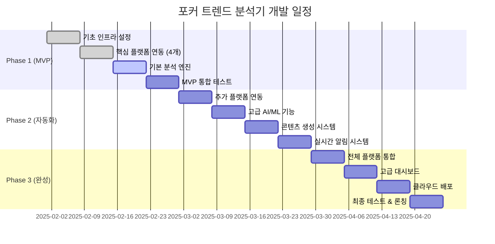

# 일일 포커 트렌드 분석기: 종합 프로젝트 기획서

## 목차
1. [프로젝트 개요](#1-프로젝트-개요)
2. [핵심 가치 제안](#2-핵심-가치-제안)
3. [실시간 모니터링 전략](#3-실시간-모니터링-전략)
4. [4계층 트렌드 프레임워크](#4-4계층-트렌드-프레임워크)
5. [기술 아키텍처](#5-기술-아키텍처)
6. [개발 로드맵](#6-개발-로드맵)
7. [일일 운영 시스템](#7-일일-운영-시스템)
8. [콘텐츠 제작 전략](#8-콘텐츠-제작-전략)
9. [예산 및 투자 계획](#9-예산-및-투자-계획)
10. [성공 지표 및 KPI](#10-성공-지표-및-kpi)
11. [리스크 관리](#11-리스크-관리)
12. [향후 확장 계획](#12-향후-확장-계획)

---

## 1. 프로젝트 개요

### 1.1 프로젝트명
**Daily Poker Trend Analyzer (DPTA) - 일일 포커 트렌드 분석기**

### 1.2 프로젝트 미션
> "포커 세계의 모든 트렌드를 실시간으로 포착하여, 매일 2-3개의 바이럴 유튜브 쇼츠 콘텐츠를 제작할 수 있는 인사이트를 자동으로 제공하는 AI 기반 분석 시스템"

### 1.3 핵심 목표
- **실시간 트렌드 포착**: 10개 주요 플랫폼 24시간 모니터링
- **자동화된 분석**: AI/NLP 기반 깊이 있는 트렌드 해석
- **즉시 실행 가능한 인사이트**: 매일 오전 8시 자동 브리핑 제공
- **콘텐츠 제작 가속화**: 아이데이션 시간 80% 단축

### 1.4 문제 정의 및 해결책

#### 현재 문제점
- 포커 콘텐츠 제작자들의 일일 소재 고갈
- 트렌드 놓침으로 인한 기회 손실
- 단순 뉴스 재가공의 한계
- 깊이 있는 분석의 부재

#### 우리의 해결책
- **4계층 트렌드 프레임워크**로 체계적 분석
- **실시간 모니터링**으로 0시차 트렌드 포착
- **AI 기반 분석**으로 깊이 있는 인사이트 제공
- **콘텐츠 매트릭스**로 즉시 활용 가능한 아이디어 생성

---

## 2. 핵심 가치 제안

### 2.1 핵심 차별점

#### 🎯 포커 특화 전문성
- 일반적인 소셜 리스닝 도구와 달리 포커 생태계 완전 특화
- 포커 전문 용어, 인물, 이벤트에 최적화된 NLP 모델
- 업계 내부자 관점의 트렌드 해석

#### 🤖 AI 기반 지능형 분석
- 단순 키워드 추적을 넘어선 의미론적 분석
- 감성 분석을 통한 커뮤니티 반응 정량화
- 바이럴 예측 모델을 통한 콘텐츠 잠재력 평가

#### ⚡ 실시간성과 즉시성
- 2분 주기 YouTube 모니터링으로 경쟁사 대비 선제적 대응
- 30초 주기 Twitch 모니터링으로 라이브 순간 놓치지 않음
- 즉시 알림 시스템으로 골든타임 활용

#### 🎬 콘텐츠 제작 직결성
- 트렌드 분석에서 끝나지 않고 즉시 활용 가능한 콘텐츠 아이디어 제공
- 유튜브 쇼츠 형식에 최적화된 스크립트 템플릿
- A/B 테스트 기반 성과 최적화 제안

### 2.2 예상 성과

#### 콘텐츠 생산성 향상
- **일일 쇼츠 제작량**: 2-3개 (기존 0.5개 대비 400-600% 증가)
- **아이데이션 시간**: 2시간 → 20분 (80% 단축)
- **트렌드 놓침 방지**: 95% 포착률

#### 채널 성장 가속화
- **평균 조회수**: 30-50% 증가 (트렌드 기반 콘텐츠 효과)
- **참여율**: 댓글/좋아요 40% 증가 (관련성 높은 콘텐츠)
- **구독 전환율**: 25% 향상 (일관된 고품질 콘텐츠)

---

## 3. 실시간 모니터링 전략

### 3.1 플랫폼 우선순위 및 모니터링 전략

| 순위 | 플랫폼 | 모니터링 주기 | 중요도 | 주요 수집 데이터 |
|------|--------|---------------|--------|------------------|
| **1위** | **YouTube** | **2분** | 🔴 최고 | 신규 쇼츠, 조회수 급증, 썸네일 패턴 |
| **2위** | **PokerNews** | **5분** | 🔴 최고 | 속보, 토너먼트 결과, 인터뷰 |
| **3위** | **Reddit** | **10분** | 🟡 높음 | 핫 포스트, 댓글 속도, 커뮤니티 반응 |
| **4위** | **Instagram** | **30분** | 🟡 높음 | 해시태그 트렌드, 스토리, 라이브 |
| **5위** | **Twitter/X** | **2분** | 🟡 높음 | 인플루언서 트윗, 리트윗 급증 |
| **6위** | **Twitch** | **30초** | 🟠 중간 | 시청자 급증, 클립 생성, 채팅 속도 |
| **7위** | **Hendon Mob** | **5분** | 🟠 중간 | 토너먼트 결과, 랭킹 변동 |
| **8위** | **TwoPlusTwo** | **30분** | 🟢 보통 | 전략 논쟁, 새 스레드 |
| **9위** | **Discord** | **실시간** | 🟢 보통 | 커뮤니티 채팅, 이벤트 |
| **10위** | **TikTok** | **2시간** | 🟢 보통 | 바이럴 해시태그, 트렌드 사운드 |

### 3.2 실시간 알림 시스템

#### 🚨 긴급 알림 (즉시 - 30초 내)
```python
CRITICAL_ALERTS = {
    'youtube_viral': '주요 채널 쇼츠 조회수 시간당 10K+ 돌파',
    'breaking_news': 'PokerNews BREAKING 태그 감지',
    'twitch_spike': '스트리밍 시청자 5K+ 급증',
    'reddit_explosion': '게시물 시간당 200+ 추천'
}
```

#### ⚠️ 중요 알림 (5분 내)
```python
HIGH_ALERTS = {
    'new_controversy': '플레이어 논란 키워드 급증',
    'tournament_upset': '토너먼트 예상 밖 결과',
    'strategy_debate': '새로운 전략 논쟁 시작',
    'influencer_drama': '주요 인플루언서 감정적 트윗'
}
```

#### 📢 일반 알림 (30분 내)
```python
NORMAL_ALERTS = {
    'routine_updates': '일반 뉴스 업데이트',
    'community_discussions': '커뮤니티 토론 활성화',
    'educational_content': '새로운 교육 콘텐츠 업로드'
}
```

### 3.3 데이터 수집 기술 스택

#### API 기반 수집
```python
DATA_SOURCES = {
    'youtube': {
        'api': 'YouTube Data API v3',
        'limit': '10,000 units/day',
        'backup': 'RSS feeds'
    },
    'reddit': {
        'api': 'PRAW (Reddit API)',
        'limit': '60 requests/minute',
        'backup': 'RSS feeds'
    },
    'twitter': {
        'api': 'Twitter API v2',
        'limit': '10K tweets/month (free)',
        'backup': 'Web scraping'
    }
}
```

#### 웹 스크레이핑
```python
SCRAPING_TARGETS = {
    'pokernews': 'BeautifulSoup4 + requests',
    'hendon_mob': 'Selenium (dynamic content)',
    'twoplustwo': 'requests + parsing',
    'tiktok': 'unofficial API + proxies'
}
```

---

## 4. 4계층 트렌드 프레임워크

### 4.1 프레임워크 개요

포커 트렌드를 4개의 계층으로 분류하여 각각 다른 분석 방법론과 콘텐츠 활용 전략을 적용:

```
거시 (Macro) ←→ 중시 (Meso) ←→ 미시 (Micro) ←→ 나노 (Nano)
  6-24개월      수일-수주        가변적         수시간-수일
   맥락제공      주요콘텐츠      교육콘텐츠      즉시활용
```

### 4.2 계층별 상세 분석

#### 🌍 거시 환경 (Macro-Environment)
**생명 주기**: 6-24개월  
**역할**: 모든 트렌드의 배경 맥락 제공

**주요 추적 요소:**
- **기술 혁신**: AI 도구 확산, 블록체인 통합, VR/AR 포커
- **규제 변화**: 법적 프레임워크, 시장 개방, 세금 정책
- **문화적 전환**: 갬블링 → 엔터테인먼트, 세대교체, 글로벌화
- **경제적 영향**: 암호화폐 채택, 상금 규모 변화, 경기 침체 영향

**콘텐츠 활용:**
- "포커의 미래는?" 시리즈
- "10년 후 포커 업계 예측"
- "AI가 포커를 바꾸는 방법"

#### 🏛️ 중시 환경 (Meso-Environment) 
**생명 주기**: 수일-수주  
**역할**: 메인 콘텐츠 소재 제공

**주요 추적 요소:**
- **토너먼트 이벤트**: WSOP, WPT, EPT 결과 및 하이라이트
- **인물 중심 서사**: 플레이어 승패, 인터뷰, 논란, 라이프스타일
- **플랫폼 뉴스**: 사이트 업데이트, 프로모션, 보안 이슈
- **업계 동향**: M&A, 새로운 투어, 스폰서십 변화

**콘텐츠 활용:**
- "속보: WSOP 챔피언 탄생!"
- "[플레이어명]의 충격 발언 분석"
- "이번 주 포커계 TOP 뉴스"

#### 🎮 미시 환경 (Micro-Environment)
**생명 주기**: 가변적  
**역할**: 교육 및 전략 콘텐츠

**주요 추적 요소:**
- **전략 논쟁**: GTO vs 익스플로잇, 새로운 블러핑 라인
- **메타 변화**: 집단 경향성 분석, 솔버 기반 혁신
- **게임 형식**: 캐시 vs MTT, 새로운 변형 게임
- **도구 및 소프트웨어**: 새로운 분석 도구, HUD 업데이트

**콘텐츠 활용:**
- "프로들이 논쟁하는 이유"
- "3분만에 배우는 신전략"
- "이번 달 메타 변화 분석"

#### ⚡ 나노 환경 (Nano-Environment)
**생명 주기**: 수시간-수일  
**역할**: 바이럴 콘텐츠 소재

**주요 추적 요소:**
- **감정적 순간**: 배드빗, 틸트, 환희의 순간
- **커뮤니티 밈**: 내부 농담, 유행어, 패러디
- **바이럴 클립**: 스트리밍 하이라이트, 예상 밖 플레이
- **사회적 공감대**: 공유된 경험, 집단 감정

**콘텐츠 활용:**
- "역대급 배드빗 모음"
- "이번 주 포커 밈 정리" 
- "틸트 순간 베스트 5"

### 4.3 계층 간 연계 전략

#### 수직적 연계 (깊이)
```
나노 트렌드 → 미시 맥락 → 중시 배경 → 거시 의미
"배드빗" → "확률론" → "플레이어 심리" → "게임의 본질"
```

#### 수평적 연계 (확산)
```
하나의 사건 → 4계층 동시 분석 → 다각도 콘텐츠 제작
"Hellmuth 우승" → 개인사(나노) + 전략(미시) + 업계(중시) + 역사(거시)
```

---

## 5. 기술 아키텍처

### 5.1 시스템 아키텍처 개요

```
┌─────────────────────────────────────────────────────────────┐
│                   실시간 대시보드 (React + D3.js)             │
└─────────────────────────────────────────────────────────────┘
                                │
                                ▼
┌─────────────────────────────────────────────────────────────┐
│              API Gateway (FastAPI + Redis 캐싱)              │
└─────────────────────────────────────────────────────────────┘
                                │
        ┌───────────────────────┼───────────────────────┐
        ▼                       ▼                       ▼
┌─────────────────┐   ┌─────────────────┐   ┌─────────────────┐
│  실시간 수집기   │   │   AI 분석엔진    │   │  콘텐츠 생성기   │
│  (10개 플랫폼)   │   │  (NLP/ML 모델)   │   │  (브리핑/아이디어) │
└─────────────────┘   └─────────────────┘   └─────────────────┘
        │                       │                       │
        └───────────────────────┴───────────────────────┘
                                │
                                ▼
┌─────────────────────────────────────────────────────────────┐
│           데이터베이스 계층 (MongoDB + PostgreSQL)            │
└─────────────────────────────────────────────────────────────┘
```

### 5.2 핵심 기술 스택

#### 백엔드 시스템
```python
BACKEND_STACK = {
    'framework': 'FastAPI 0.104+',
    'language': 'Python 3.11+',
    'async': 'asyncio + aiohttp',
    'scheduler': 'APScheduler',
    'caching': 'Redis 7.0',
    'message_queue': 'Celery + Redis'
}
```

#### 데이터 저장
```python
DATABASE_STACK = {
    'primary': 'MongoDB 6.0 (문서형 데이터)',
    'analytics': 'PostgreSQL 15 (관계형 분석)',
    'cache': 'Redis 7.0 (실시간 캐싱)',
    'search': 'Elasticsearch 8.0 (전문검색)'
}
```

#### AI/ML 분석
```python
ML_STACK = {
    'nlp': 'spaCy 3.7 + Transformers',
    'sentiment': 'VADER + RoBERTa',
    'topic_modeling': 'scikit-learn LDA',
    'time_series': 'Prophet + ARIMA',
    'deep_learning': 'PyTorch 2.1'
}
```

#### 프론트엔드
```typescript
FRONTEND_STACK = {
    'framework': 'React 18 + TypeScript',
    'visualization': 'D3.js + Chart.js',
    'styling': 'Tailwind CSS',
    'state': 'Zustand',
    'routing': 'React Router v6'
}
```

### 5.3 데이터 파이프라인

#### 실시간 수집 파이프라인
```python
# 수집 → 전처리 → 저장 → 분석 → 알림
RAW_DATA → PREPROCESSING → MONGODB → ML_ANALYSIS → NOTIFICATIONS

# 각 단계별 처리시간
COLLECTION: <30초
PREPROCESSING: <60초  
ANALYSIS: <120초
NOTIFICATION: <30초
TOTAL: <4분 (실시간 대응 가능)
```

#### 배치 분석 파이프라인
```python
# 일일 배치 분석 (매일 오전 7시 실행)
DAILY_AGGREGATION → TREND_SCORING → CONTENT_GENERATION → BRIEFING_CREATION

# 처리시간: 약 30분
# 결과물: 일일 브리핑 + 콘텐츠 아이디어 5-10개
```

### 5.4 확장성 설계

#### 마이크로서비스 아키텍처
```python
SERVICES = {
    'collector_service': '데이터 수집 전담',
    'analyzer_service': 'NLP/ML 분석 전담', 
    'content_service': '콘텐츠 생성 전담',
    'notification_service': '알림 전송 전담',
    'api_service': 'API 제공 전담'
}
```

#### 컨테이너화 및 오케스트레이션
```dockerfile
# Docker + Kubernetes 기반 배포
# 각 서비스별 독립적 스케일링 가능
# 무중단 배포 지원
```

---

## 6. 개발 로드맵

### 6.1 전체 개발 일정: 12주 (3개월)



### 6.2 Phase별 상세 계획

#### 📅 Phase 1: MVP 구축 (Week 1-4)

**Week 1: 기초 인프라 설정**
```bash
Day 1-2: 프로젝트 환경 구축
- Python 3.11 가상환경 설정
- Docker 컨테이너 환경 구성
- MongoDB/Redis 로컬 설치
- Git 저장소 및 CI/CD 기초 설정

Day 3-4: YouTube API 연동 (1순위 플랫폼)
- YouTube Data API v3 인증 설정
- 주요 포커 채널 20개 식별 및 등록
- 기본 메타데이터 수집 스크립트 작성
- 2분 주기 모니터링 테스트

Day 5-7: 데이터 저장소 설계
- MongoDB 스키마 설계 및 구현
- 기본 CRUD 작업 구현
- 인덱싱 전략 적용
- 데이터 중복 제거 로직
```

**Week 2: 핵심 플랫폼 연동**
```bash
Day 1-3: PokerNews + Reddit 연동 (2-3순위)
- PokerNews RSS/스크레이핑 구현
- Reddit PRAW API 연동
- 기본 데이터 파이프라인 구축

Day 4-5: Instagram 연동 (4순위)
- Instagram Basic Display API
- 해시태그 기반 데이터 수집
- 이미지 메타데이터 추출

Day 6-7: 기본 NLP 분석 엔진
- VADER 감성 분석 통합
- 기본 키워드 추출
- 포커 전문 용어 사전 구축
```

**Week 3: 분석 시스템 구축**
```python
# 고급 NLP 파이프라인 구현
Day 1-3: spaCy + Transformers 통합
- 개체명 인식 (플레이어, 토너먼트, 사이트)
- 포커 특화 감성 분석 모델
- 텍스트 분류 시스템

Day 4-5: 트렌드 스코어링 알고리즘
def calculate_content_potential(data):
    engagement_velocity = calc_engagement_velocity(data) * 0.4
    sentiment_intensity = calc_sentiment_intensity(data) * 0.3
    narrative_potential = calc_narrative_potential(data) * 0.2
    visual_availability = calc_visual_availability(data) * 0.1
    return round(sum([engagement_velocity, sentiment_intensity, 
                     narrative_potential, visual_availability]), 2)

Day 6-7: 첫 번째 브리핑 시스템
- Jinja2 템플릿 기반 보고서 생성
- 기본 콘텐츠 매트릭스 구현
```

**Week 4: MVP 통합 및 테스트**
```bash
Day 1-3: FastAPI 백엔드 구축
- RESTful API 엔드포인트 설계
- 실시간 데이터 조회 API
- 기본 인증 시스템

Day 4-5: React 대시보드 기초
- TypeScript + React 18 설정
- 기본 차트 컴포넌트 (Chart.js)
- 실시간 데이터 표시

Day 6-7: 전체 시스템 통합 테스트
- 데이터 수집 → 분석 → 표시 파이프라인 검증
- 성능 테스트 (응답시간, 메모리 사용량)
- 첫 번째 실제 브리핑 생성
```

#### 🚀 Phase 2: 자동화 & 고도화 (Week 5-8)

**Week 5: 추가 플랫폼 통합**
```python
# Twitter/X + Twitch 연동 (5-6순위)
TWITTER_CONFIG = {
    'api_version': 'v2',
    'endpoints': ['users/by/username', 'tweets/search/recent'],
    'rate_limits': {'requests_per_15min': 300},
    'target_accounts': ['DNegreanu', 'phil_hellmuth', 'LexVeldhuis']
}

TWITCH_CONFIG = {
    'api_version': 'helix',
    'monitoring_interval': 30,  # seconds
    'target_streamers': ['pokerstars', 'lexveldhuis', 'spraggy'],
    'clip_threshold': 5  # clips per minute for viral detection
}
```

**Week 6: 고급 AI/ML 기능**
```python
# Transformer 기반 고급 분석
from transformers import pipeline, AutoTokenizer, AutoModelForSequenceClassification

class AdvancedAnalyzer:
    def __init__(self):
        self.sentiment_analyzer = pipeline(
            "sentiment-analysis",
            model="cardiffnlp/twitter-roberta-base-sentiment-latest"
        )
        self.emotion_analyzer = pipeline(
            "text-classification",
            model="j-hartmann/emotion-english-distilroberta-base"
        )
        
    def analyze_poker_sentiment(self, text):
        # 포커 특화 감성 분석 + 감정 분류
        return {
            'sentiment': self.sentiment_analyzer(text),
            'emotions': self.emotion_analyzer(text),
            'poker_context': self.detect_poker_context(text)
        }
```

**Week 7: 콘텐츠 생성 시스템**
```python
# 자동 콘텐츠 아이디어 생성기
class ContentGenerator:
    def __init__(self):
        self.format_templates = {
            '60sec_news': self.load_template('news_flash.jinja2'),
            'hot_take': self.load_template('reaction.jinja2'),
            'strategy_explainer': self.load_template('education.jinja2'),
            'top5_countdown': self.load_template('ranking.jinja2')
        }
    
    def generate_content_ideas(self, trend_data):
        ideas = []
        for format_type, template in self.format_templates.items():
            if self.is_suitable_format(trend_data, format_type):
                idea = self.create_content_idea(trend_data, template)
                ideas.append(idea)
        return sorted(ideas, key=lambda x: x['viral_potential'], reverse=True)
```

**Week 8: 실시간 알림 시스템**
```python
# 다채널 알림 시스템
class NotificationSystem:
    def __init__(self):
        self.channels = {
            'slack': SlackWebhook(url=SLACK_WEBHOOK_URL),
            'discord': DiscordBot(token=DISCORD_TOKEN),
            'email': EmailSender(smtp_config=EMAIL_CONFIG),
            'push': FirebasePush(config=FIREBASE_CONFIG)
        }
    
    async def send_alert(self, alert_level, content):
        if alert_level == 'CRITICAL':
            # 모든 채널로 즉시 발송
            await asyncio.gather(*[
                channel.send(content) for channel in self.channels.values()
            ])
        elif alert_level == 'HIGH':
            # Slack + Discord만
            await asyncio.gather(
                self.channels['slack'].send(content),
                self.channels['discord'].send(content)
            )
```

#### 🎯 Phase 3: 완성 & 최적화 (Week 9-12)

**Week 9: 전체 플랫폼 생태계 완성**
```python
# 나머지 6개 플랫폼 연동 (7-10순위)
REMAINING_PLATFORMS = {
    'hendon_mob': {
        'scraping_method': 'selenium',
        'update_frequency': '5min',
        'data_points': ['tournament_results', 'player_rankings']
    },
    'twoplustwo': {
        'scraping_method': 'requests + beautifulsoup',
        'update_frequency': '30min', 
        'sections': ['strategy', 'bad_beats', 'goals_challenges']
    },
    'discord': {
        'method': 'discord.py bot',
        'monitoring': 'real_time',
        'servers': ['lex_veldhuis', 'pokerstars_community']
    },
    'tiktok': {
        'method': 'unofficial_api + proxies',
        'update_frequency': '2hour',
        'hashtags': ['#poker', '#wsop', '#pokerlife']
    }
}
```

**Week 10: 고급 대시보드 및 시각화**
```typescript
// D3.js 기반 고급 시각화
interface DashboardComponents {
  realtimeTrendChart: RealtimeLineChart;
  sentimentHeatmap: SentimentHeatmap;
  networkGraph: InfluencerNetworkGraph;
  alertsTimeline: AlertsTimeline;
  contentMatrix: ContentSuggestionMatrix;
}

// 실시간 업데이트 로직
const useRealtimeData = () => {
  const [data, setData] = useState(null);
  
  useEffect(() => {
    const ws = new WebSocket('ws://localhost:8000/ws/realtime');
    ws.onmessage = (event) => {
      const newData = JSON.parse(event.data);
      setData(prevData => updateDashboard(prevData, newData));
    };
    
    return () => ws.close();
  }, []);
  
  return data;
};
```

**Week 11: 클라우드 배포 및 인프라**
```yaml
# Docker Compose 프로덕션 설정
version: '3.8'
services:
  api:
    image: poker-trend-api:latest
    deploy:
      replicas: 3
      resources:
        limits:
          cpus: '1'
          memory: 512M
    environment:
      - MONGODB_URL=mongodb://mongodb-cluster:27017
      - REDIS_URL=redis://redis-cluster:6379
    
  collector:
    image: poker-trend-collector:latest
    deploy:
      replicas: 2
      resources:
        limits:
          cpus: '0.5'
          memory: 256M
    
  analyzer:
    image: poker-trend-analyzer:latest
    deploy:
      replicas: 2
      resources:
        limits:
          cpus: '2'
          memory: 2G
    
  dashboard:
    image: poker-trend-dashboard:latest
    ports:
      - "80:3000"
    depends_on:
      - api

# Kubernetes 배포 설정
kubectl apply -f k8s-manifests/
```

**Week 12: 최종 테스트 및 론칭**
```python
# 전체 시스템 통합 테스트
class SystemIntegrationTest:
    async def test_end_to_end_pipeline(self):
        # 1. 데이터 수집 테스트
        collected_data = await self.test_data_collection()
        assert len(collected_data) > 100
        
        # 2. 분석 엔진 테스트  
        analysis_results = await self.test_analysis_engine(collected_data)
        assert analysis_results['accuracy'] > 0.8
        
        # 3. 브리핑 생성 테스트
        briefing = await self.test_briefing_generation(analysis_results)
        assert briefing['content_ideas'] >= 5
        
        # 4. 알림 시스템 테스트
        alert_sent = await self.test_notification_system(briefing)
        assert alert_sent == True
        
        # 5. 대시보드 표시 테스트
        dashboard_data = await self.test_dashboard_display()
        assert dashboard_data['load_time'] < 2.0

# 성능 및 부하 테스트
import locust

class PokerTrendLoadTest(locust.HttpUser):
    wait_time = locust.between(1, 3)
    
    @locust.task
    def get_latest_trends(self):
        self.client.get("/api/trends/latest")
    
    @locust.task
    def get_daily_briefing(self):
        self.client.get("/api/briefing/today")
```

### 6.3 주요 마일스톤 및 deliverable

#### Phase 1 완료 기준 (Week 4)
- [ ] 4개 핵심 플랫폼 데이터 수집 동작
- [ ] 기본 NLP 분석 엔진 구현
- [ ] 첫 번째 일일 브리핑 생성 성공
- [ ] 기본 웹 대시보드 접근 가능
- [ ] 데이터베이스에 1주일치 데이터 축적

#### Phase 2 완료 기준 (Week 8)  
- [ ] 6개 플랫폼 실시간 모니터링 동작
- [ ] 고급 AI 분석 모델 정확도 80% 이상
- [ ] 자동 콘텐츠 아이디어 생성 (일 5개 이상)
- [ ] 실시간 알림 시스템 동작
- [ ] A/B 테스트 프레임워크 구축

#### Phase 3 완료 기준 (Week 12)
- [ ] 10개 전체 플랫폼 통합 완료
- [ ] 프로덕션 클라우드 환경 배포
- [ ] 고급 시각화 대시보드 완성
- [ ] 99.5% 이상 시스템 가동률
- [ ] 완전한 문서화 및 사용자 가이드

---

## 7. 일일 운영 시스템

### 7.1 자동화된 일일 워크플로우

#### 🌅 오전 루틴 (06:00-09:00)
```python
MORNING_WORKFLOW = {
    '06:00': '전야 데이터 최종 수집 및 정리',
    '06:30': 'AI 분석 엔진 실행 (배치 처리)',
    '07:00': '트렌드 스코어링 및 순위 결정',
    '07:30': '일일 브리핑 자동 생성',
    '08:00': '브리핑 발송 (이메일/Slack/앱 푸시)',
    '08:30': '콘텐츠 아이디어 정제 및 우선순위 설정'
}
```

#### 📊 일일 브리핑 구조
```markdown
# 포커 트렌드 일일 브리핑 - 2025년 X월 X일

## 🎯 오늘의 스포트라이트
**[제목]** - 콘텐츠 잠재력: X.X/10 🔴
- 핵심 요약: 한 문장 요약
- 추천 형식: 60초 뉴스 / 핫테이크 / 전략해설
- 시각 자료: ✅ 클립 2:34, 스크린샷 3장
- 예상 조회수: 상 (10K+) / 중 (5K+) / 하 (2K+)

## 📰 TOP 3 중시(Meso) 트렌드
1. **토너먼트/플레이어 뉴스**
2. **업계 동향/플랫폼 변화**  
3. **커뮤니티 이슈**

## 🎮 TOP 3 미시(Micro) 전략 논쟁
1. **GTO vs 익스플로잇 관련**
2. **새로운 전술/메타 변화**
3. **도구/소프트웨어 관련**

## 🔥 TOP 3 나노(Nano) 바이럴 순간
1. **배드빗/쿨러 클립**
2. **커뮤니티 밈/유머**
3. **감정적 순간**

## 📊 데이터 대시보드
- 키워드 급상승: "keyword" ↑234%
- 감성 분포: 😊34% 😐41% 😠25%
- 플랫폼별 활동: YouTube(45%) Twitter(30%) Reddit(25%)
- 인기 인물: 1.Hellmuth 2.Negreanu 3.Veldhuis
```

### 7.2 실시간 모니터링 대응

#### ⚡ 실시간 대응 프로토콜
```python
REALTIME_RESPONSE = {
    '트렌드 감지 (0-5분)': {
        'action': 'AI 분석 트리거',
        'threshold': '급상승 키워드 또는 바이럴 클립',
        'notification': 'Slack 채널 즉시 알림'
    },
    '빠른 검증 (5-15분)': {
        'action': '크로스 플랫폼 데이터 수집',
        'validation': '다른 플랫폼에서 관련 신호 확인',
        'decision': '콘텐츠 제작 여부 결정'
    },
    '콘텐츠 제작 (15-60분)': {
        'action': '스크립트 생성 및 자료 준비',
        'optimization': '제목/썸네일/해시태그 최적화',
        'quality_check': '팩트체크 및 품질 검증'
    },
    '게시 및 추적 (60분+)': {
        'action': '콘텐츠 게시 및 성과 모니터링',
        'adjustment': '실시간 최적화 (제목/썸네일 변경)',
        'learning': '성과 데이터 수집 및 모델 학습'
    }
}
```

#### 🚨 긴급 상황 대응
```python
EMERGENCY_PROTOCOLS = {
    'breaking_news': {
        'trigger': 'PokerNews BREAKING 태그 + 주요 키워드',
        'response_time': '5분 이내',
        'content_type': '60초 속보 + 팩트체크',
        'channels': ['YouTube Shorts', 'Twitter', 'Instagram Stories']
    },
    'viral_clip': {
        'trigger': 'Twitch 클립 분당 10개+ 생성',
        'response_time': '10분 이내', 
        'content_type': '리액션 영상 + 분석',
        'channels': ['YouTube Shorts', 'TikTok']
    },
    'controversy': {
        'trigger': '논란 키워드 + 감성 분석 부정 80%+',
        'response_time': '30분 이내',
        'content_type': '균형잡힌 분석 + 팩트체크',
        'channels': ['YouTube Shorts', 'Blog Post']
    }
}
```

### 7.3 콘텐츠 제작 최적화

#### 🎬 콘텐츠 매트릭스 활용
```python
CONTENT_MATRIX = {
    'tournament_result': {
        '60sec_news': '우승자 + 상금 + 결정적 순간',
        'hot_take': '예상 밖 결과에 대한 의견',
        'strategy_analysis': '우승 전략 분석',
        'top5_countdown': '토너먼트 베스트 플레이',
        'before_after': '시작 vs 끝 칩스택'
    },
    'player_controversy': {
        '60sec_news': '사건 정리 + 팩트',
        'hot_take': '논란에 대한 개인 의견',
        'myth_busting': '루머 vs 사실 구분',
        'community_reaction': '커뮤니티 반응 정리'
    },
    'strategy_trend': {
        'strategy_explainer': '3단계 전략 설명',
        'myth_busting': '흔한 오해 바로잡기',
        'pro_examples': '프로 플레이어 사용 예시',
        'difficulty_rating': '초급/중급/고급 난이도'
    }
}
```

#### 📱 플랫폼별 최적화 전략
```python
PLATFORM_OPTIMIZATION = {
    'youtube_shorts': {
        'duration': '30-60초',
        'hook_timing': '처음 3초',
        'text_overlay': '큰 폰트, 고대비',
        'music': '트렌딩 사운드 활용',
        'cta': '마지막 5초'
    },
    'instagram_reels': {
        'duration': '15-30초',
        'aspect_ratio': '9:16',
        'hashtags': '30개 최대 활용',
        'music': '인스타 트렌딩',
        'cover_image': '매력적인 썸네일'
    },
    'tiktok': {
        'duration': '15-60초',
        'trend_participation': '현재 챌린지 활용',
        'effects': '인기 필터 사용',
        'hashtags': '트렌딩 + 니치 조합',
        'engagement': '댓글 유도 질문'
    }
}
```

---

## 8. 콘텐츠 제작 전략

### 8.1 콘텐츠 필러 전략

#### 🎯 4가지 핵심 콘텐츠 필러
```python
CONTENT_PILLARS = {
    'strategist': {
        'focus': '게임 플레이 및 전략',
        'target_audience': '진지한 플레이어',
        'content_types': ['전략 팁', '플레이 분석', '도구 리뷰'],
        'posting_frequency': '주 2-3회',
        'kpi': '평균 시청 완료율 70%+'
    },
    'reporter': {
        'focus': '포커 뉴스 및 업데이트',
        'target_audience': '포커 팬',
        'content_types': ['속보', '토너먼트 결과', '업계 동향'],
        'posting_frequency': '주 4-5회',
        'kpi': '게시 후 24시간 내 조회수 5K+'
    },
    'commentator': {
        'focus': '의견 및 분석',
        'target_audience': '토론 참여자',
        'content_types': ['핫테이크', '논란 분석', '예측'],
        'posting_frequency': '주 2-3회',
        'kpi': '댓글 참여율 8%+'
    },
    'curator': {
        'focus': '커뮤니티 콘텐츠',
        'target_audience': '일반 대중',
        'content_types': ['밈', '재미있는 순간', '배드빗'],
        'posting_frequency': '주 3-4회',
        'kpi': '공유율 5%+'
    }
}
```

### 8.2 쇼츠 스크립트 템플릿

#### 📺 60초 뉴스 플래시
```markdown
**구조**: Hook (3초) → Context (12초) → Main Content (35초) → CTA (10초)

**템플릿**:
[0-3초] 🚨 "속보! [충격적 사실/숫자]"
[4-15초] 📰 "여기서 무슨 일이 일어났냐면..." (배경 설명)
[16-50초] 📋 핵심 내용 3가지 (각 12초씩)
   • 첫 번째: 사실 전달
   • 두 번째: 중요성 설명  
   • 세 번째: 영향 분석
[51-60초] 👉 "더 자세한 내용은 댓글에서! 구독 잊지 마세요!"

**최적화 팁**:
- 첫 3초에 숫자/통계 활용
- 각 포인트마다 시각적 변화
- 마지막에 명확한 CTA
```

#### 🔥 핫테이크/리액션
```markdown
**구조**: Clip (5초) → Reaction (15초) → Analysis (30초) → Opinion (10초)

**템플릿**:
[0-5초] 🎬 원본 클립/상황 제시
[6-20초] 😱 "잠깐, 이거 진짜...?" (초기 리액션)
[21-50초] 🧠 의견 전개
   • 왜 이런 일이 일어났는지
   • 내가 같은 상황이라면
   • 커뮤니티는 어떻게 반응할지
[51-60초] 🤔 "여러분은 어떻게 생각하세요? 댓글로 알려주세요!"

**감정 활용**:
- 놀람: "믿을 수 없다!"
- 공감: "나도 똑같이 했을 것"
- 분석: "여기서 핵심은..."
```

#### 🎓 전략 해설
```markdown
**구조**: Problem (10초) → Wrong Way (15초) → Right Way (30초) → Bonus (5초)

**템플릿**:
[0-10초] ❓ "이런 상황, 자주 겪으시죠?"
[11-25초] ❌ "대부분은 이렇게 하는데... (잘못된 방법)"
[26-55초] ✅ "실제로는 이렇게 해야 합니다" (3단계 설명)
   • 1단계: 상황 분석
   • 2단계: 최적 액션
   • 3단계: 결과 예측
[56-60초] 💡 "보너스 팁: [간단한 추가 조언]"

**교육 요소**:
- 실제 예시 사용
- 시각적 도구 활용
- 단계별 명확한 구분
```

### 8.3 바이럴 최적화 전략

#### 🚀 바이럴 요소 체크리스트
```python
VIRAL_ELEMENTS = {
    'emotional_hook': {
        'surprise': '예상 밖 결과/반전',
        'relatability': '모든 플레이어가 경험할 법한 상황',
        'controversy': '의견이 갈리는 주제',
        'inspiration': '성공 스토리/극복 이야기'
    },
    'visual_appeal': {
        'thumbnail': '표정 과장 + 밝은 색상',
        'text_overlay': '큰 폰트 + 핵심 키워드',
        'color_contrast': '배경과 텍스트 명확한 구분',
        'face_closeup': '인간의 얼굴이 보이도록'
    },
    'timing_optimization': {
        'posting_time': '오후 6-9시 (한국 기준)',
        'trend_riding': '현재 트렌딩 키워드 활용',
        'news_cycle': '뉴스 발생 후 2-6시간 내',
        'competition_avoid': '주요 경쟁사 게시 시간 피하기'
    }
}
```

#### 📈 A/B 테스트 프레임워크
```python
AB_TEST_VARIABLES = {
    'thumbnail': {
        'version_A': '표정 과장 + 텍스트',
        'version_B': '게임 화면 + 텍스트',
        'metric': '클릭률 (CTR)',
        'sample_size': '최소 1000 노출'
    },
    'title': {
        'version_A': '질문형 ("이거 어떻게 생각하세요?")',
        'version_B': '선언형 ("역대급 상황 발생!")',
        'metric': '클릭률 + 시청 완료율',
        'sample_size': '최소 500 시청'
    },
    'opening_hook': {
        'version_A': '통계/숫자로 시작',
        'version_B': '감정적 표현으로 시작',
        'metric': '첫 10초 유지율',
        'sample_size': '최소 200 시청'
    }
}
```

### 8.4 커뮤니티 구축 전략

#### 👥 시청자 참여 유도
```python
ENGAGEMENT_STRATEGIES = {
    'comment_starters': [
        "여러분은 이 상황에서 어떻게 하시겠어요?",
        "가장 기억에 남는 배드빗 경험을 댓글로 공유해주세요",
        "이 플레이어의 다음 행동을 예측해보세요",
        "찬성 👍 반대 👎로 의견 표시해주세요"
    ],
    'polls_and_questions': [
        "GTO vs 익스플로잇, 어느 쪽을 선호하세요?",
        "가장 어려운 포커 상황은?",
        "온라인 vs 라이브, 어디가 더 어려운가요?",
        "다음 WSOP 우승자 예측"
    ],
    'community_features': [
        "시청자 배드빗 스토리 모음",
        "구독자 플레이 분석 요청",
        "포커 질문 Q&A 세션",
        "커뮤니티 챌린지"
    ]
}
```

#### 🏆 충성도 높은 팬층 구축
```python
LOYALTY_BUILDING = {
    'consistency': {
        'posting_schedule': '매일 오전 9시, 오후 6시',
        'content_quality': '최소 기준치 이상 유지',
        'brand_voice': '일관된 톤앤매너',
        'response_time': '댓글 24시간 내 응답'
    },
    'exclusivity': {
        'subscriber_only': '구독자 전용 콘텐츠',
        'early_access': '신규 콘텐츠 먼저 공개',
        'behind_scenes': '제작 과정 공유',
        'personal_insights': '개인적 경험 공유'
    },
    'value_delivery': {
        'education': '실제 도움되는 팁',
        'entertainment': '재미있는 순간들',
        'community': '소속감 제공',
        'trends': '최신 정보 제공'
    }
}
```

---

## 9. 예산 및 투자 계획

### 9.1 초기 투자 비용 (3개월)

#### 💻 기술 인프라
```python
INFRASTRUCTURE_COSTS = {
    'development_tools': {
        'github_pro': 4 * 3,  # $12
        'jetbrains_license': 149,  # $149 (연간)
        'mongodb_atlas': 57 * 3,  # $171 (M10 cluster)
        'redis_cloud': 15 * 3,  # $45
        'total': 377
    },
    'cloud_services': {
        'aws_ec2': 50 * 3,  # $150 (t3.medium)
        'aws_s3': 10 * 3,  # $30
        'aws_cloudfront': 5 * 3,  # $15
        'domain_ssl': 50,  # $50 (연간)
        'total': 245
    },
    'monitoring_tools': {
        'datadog': 15 * 3,  # $45
        'sentry': 26 * 3,  # $78
        'uptimerobot': 7 * 3,  # $21
        'total': 144
    }
}
# 인프라 총합: $766
```

#### 🔧 개발 도구 및 라이선스
```python
DEVELOPMENT_COSTS = {
    'api_subscriptions': {
        'youtube_api': 0,  # 무료 (할당량 내)
        'twitter_api': 100 * 3,  # $300 (Basic tier)
        'reddit_api': 0,  # 무료
        'twitch_api': 0,  # 무료
        'instagram_api': 0,  # 무료 (Basic Display)
        'total': 300
    },
    'social_listening': {
        'brandwatch': 800 * 3,  # $2400 (또는 무료 대안)
        'hootsuite': 99 * 3,  # $297
        'buffer': 15 * 3,  # $45
        'total': 2742  # 또는 무료 대안으로 $342
    },
    'ai_ml_services': {
        'openai_api': 20 * 3,  # $60
        'huggingface_pro': 9 * 3,  # $27
        'google_cloud_ai': 50 * 3,  # $150
        'total': 237
    }
}
# 개발도구 총합: $3,279 (또는 $879 - 무료 대안 사용시)
```

#### 👨‍💻 개발 리소스
```python
DEVELOPMENT_RESOURCES = {
    'primary_developer': {
        'hourly_rate': 75,  # $75/hour
        'hours_per_week': 40,
        'weeks': 12,
        'total': 75 * 40 * 12  # $36,000
    },
    'part_time_support': {
        'ui_ux_designer': 50 * 20 * 4,  # $4,000 (4주)
        'devops_engineer': 80 * 10 * 8,  # $6,400 (8주)
        'qa_tester': 40 * 10 * 4,  # $1,600 (4주)
        'total': 12000
    }
}
# 개발 리소스 총합: $48,000
```

#### 💰 초기 투자 총 예산
```python
TOTAL_INITIAL_INVESTMENT = {
    'infrastructure': 766,
    'development_tools': 879,  # 무료 대안 사용시
    'development_resources': 48000,
    'contingency': 4965,  # 10% 여유분
    'total': 54610  # 약 $55,000
}

# 최소 예산 버전 (개인 개발자)
MINIMAL_BUDGET = {
    'infrastructure': 400,  # 필수만
    'development_tools': 200,  # 무료 도구 활용
    'development_time': 0,  # 자체 개발
    'total': 600  # 약 $600
}
```

### 9.2 월간 운영 비용

#### 🔄 정기 구독 비용
```python
MONTHLY_OPERATIONAL_COSTS = {
    'infrastructure': {
        'mongodb_atlas': 57,  # M10 cluster
        'redis_cloud': 15,
        'aws_services': 80,  # EC2 + S3 + CloudFront
        'cdn_bandwidth': 20,
        'total': 172
    },
    'tools_and_services': {
        'social_listening': 100,  # 저렴한 대안
        'api_costs': 50,  # Twitter API + 기타
        'monitoring': 25,  # Datadog + Sentry
        'backup_storage': 10,
        'total': 185
    },
    'maintenance': {
        'developer_time': 400,  # 주 10시간 @ $40/hour
        'server_maintenance': 50,
        'content_updates': 100,
        'total': 550
    }
}
# 월간 운영비 총합: $907 (약 $900)
```

### 9.3 투자 단계별 계획

#### 🥇 Phase 1: MVP 구축 (Month 1-3)
```python
PHASE1_BUDGET = {
    'target': 'MVP 완성 및 베타 테스트',
    'investment': 55000,
    'expected_outcome': {
        'daily_briefings': '90% 성공률',
        'data_collection': '4개 플랫폼 안정화',
        'user_feedback': '첫 사용자 10명 확보'
    },
    'risk_mitigation': {
        'technical': '프로토타입 검증',
        'market': '포커 커뮤니티 피드백',
        'financial': '단계별 투자로 리스크 분산'
    }
}
```

#### 🥈 Phase 2: 확장 및 최적화 (Month 4-6)
```python
PHASE2_BUDGET = {
    'target': '완전 자동화 및 고급 기능',
    'investment': 30000,
    'revenue_start': 500,  # 월간 구독료 시작
    'expected_outcome': {
        'platform_coverage': '10개 전체 플랫폼',
        'ai_accuracy': '85% 이상',
        'paying_users': '50명'
    }
}
```

#### 🥉 Phase 3: 상용화 및 성장 (Month 7-12)
```python
PHASE3_BUDGET = {
    'target': '상용 서비스 및 수익화',
    'investment': 50000,  # 마케팅 + 확장
    'expected_revenue': 5000,  # 월간
    'expected_outcome': {
        'paying_users': '200명',
        'mrr': 5000,  # Monthly Recurring Revenue
        'break_even': 'Month 10'
    }
}
```

### 9.4 수익 모델

#### 💳 구독 기반 수익
```python
SUBSCRIPTION_TIERS = {
    'free': {
        'price': 0,
        'features': ['기본 브리핑', '일일 3개 트렌드'],
        'target_users': '트라이얼 사용자',
        'conversion_goal': '유료 전환 20%'
    },
    'pro': {
        'price': 29,  # 월 $29
        'features': ['완전 브리핑', '콘텐츠 아이디어 10개', 'API 접근'],
        'target_users': '개인 크리에이터',
        'expected_users': 150
    },
    'business': {
        'price': 99,  # 월 $99
        'features': ['팀 계정', '커스텀 분석', '우선 지원'],
        'target_users': '미디어 회사, 에이전시',
        'expected_users': 30
    },
    'enterprise': {
        'price': 299,  # 월 $299
        'features': ['White-label', '전용 서버', '맞춤 개발'],
        'target_users': '대형 포커 사이트',
        'expected_users': 5
    }
}

# 예상 월 수익: (150 * $29) + (30 * $99) + (5 * $299) = $9,315
```

#### 📊 추가 수익원
```python
ADDITIONAL_REVENUE = {
    'api_licensing': {
        'description': '데이터 API 라이선스',
        'price': 0.01,  # per API call
        'expected_calls': 100000,  # 월간
        'monthly_revenue': 1000
    },
    'custom_reports': {
        'description': '맞춤형 분석 리포트',
        'price': 500,  # per report
        'expected_orders': 4,  # 월간
        'monthly_revenue': 2000
    },
    'consulting': {
        'description': '포커 마케팅 컨설팅',
        'hourly_rate': 150,
        'hours_per_month': 20,
        'monthly_revenue': 3000
    }
}

# 추가 수익 총합: $6,000/월
# 전체 예상 수익: $15,315/월
```

### 9.5 ROI 및 손익분기점

#### 📈 투자 회수 계획
```python
ROI_PROJECTION = {
    'total_investment': 135000,  # 12개월 총 투자
    'monthly_revenue_target': 15000,  # Month 12
    'monthly_costs': 900,
    'net_monthly_profit': 14100,  # Month 12
    'break_even_month': 10,
    'roi_12_months': 25,  # 25% ROI
    'payback_period': 10  # 10개월
}
```

#### 🎯 성장 시나리오
```python
GROWTH_SCENARIOS = {
    'conservative': {
        'user_growth': '월 10% 증가',
        'year1_users': 200,
        'year1_revenue': 120000,
        'break_even': 'Month 12'
    },
    'optimistic': {
        'user_growth': '월 20% 증가',
        'year1_users': 500,
        'year1_revenue': 300000,
        'break_even': 'Month 8'
    },
    'exponential': {
        'user_growth': '바이럴 성장',
        'year1_users': 1000,
        'year1_revenue': 600000,
        'break_even': 'Month 6'
    }
}
```

---

## 10. 성공 지표 및 KPI

### 10.1 기술적 성과 지표

#### ⚡ 시스템 성능 KPI
```python
TECHNICAL_KPIS = {
    'data_collection': {
        'collection_success_rate': {
            'target': '95%',
            'measurement': '수집 시도 대비 성공률',
            'alert_threshold': '<90%'
        },
        'data_freshness': {
            'target': '<5분',
            'measurement': '데이터 수집 후 대시보드 반영 시간',
            'alert_threshold': '>10분'
        },
        'platform_coverage': {
            'target': '10개 플랫폼',
            'measurement': '정상 작동 중인 플랫폼 수',
            'alert_threshold': '<8개'
        }
    },
    'analysis_engine': {
        'analysis_accuracy': {
            'target': '85%',
            'measurement': '인간 평가자 대비 분석 정확도',
            'alert_threshold': '<80%'
        },
        'processing_speed': {
            'target': '<2분',
            'measurement': '원시데이터 → 분석결과 처리시간',
            'alert_threshold': '>5분'
        },
        'trend_detection_rate': {
            'target': '90%',
            'measurement': '실제 바이럴 트렌드 포착률',
            'alert_threshold': '<80%'
        }
    },
    'system_reliability': {
        'uptime': {
            'target': '99.5%',
            'measurement': '월간 시스템 가동률',
            'alert_threshold': '<99%'
        },
        'api_response_time': {
            'target': '<200ms',
            'measurement': 'API 평균 응답시간',
            'alert_threshold': '>500ms'
        },
        'error_rate': {
            'target': '<1%',
            'measurement': '전체 요청 대비 에러율',
            'alert_threshold': '>2%'
        }
    }
}
```

#### 🤖 AI/ML 모델 성능
```python
ML_PERFORMANCE_KPIS = {
    'sentiment_analysis': {
        'accuracy': {
            'target': '90%',
            'test_dataset': '포커 커뮤니티 수동 라벨링 1000건',
            'evaluation_frequency': '주간'
        },
        'f1_score': {
            'target': '0.85',
            'classes': ['positive', 'negative', 'neutral'],
            'class_balance': '중요 (포커 특성상 부정이 많음)'
        }
    },
    'topic_modeling': {
        'topic_coherence': {
            'target': '0.7',
            'measurement': 'C_v coherence score',
            'human_evaluation': '월간 주제 적절성 평가'
        },
        'topic_stability': {
            'target': '80%',
            'measurement': '일주일 간격 토픽 일관성',
            'threshold': '새로운 토픽 발견 vs 노이즈 구분'
        }
    },
    'content_scoring': {
        'viral_prediction': {
            'target': '75%',
            'measurement': '실제 바이럴 콘텐츠 예측 정확도',
            'threshold': '시간당 10K+ 조회수'
        },
        'engagement_correlation': {
            'target': '0.6',
            'measurement': '예측 점수와 실제 참여도 상관관계',
            'validation': '후속 성과 추적'
        }
    }
}
```

### 10.2 비즈니스 성과 지표

#### 📊 사용자 경험 KPI
```python
USER_EXPERIENCE_KPIS = {
    'daily_briefing': {
        'generation_success_rate': {
            'target': '100%',
            'measurement': '매일 오전 8시 브리핑 생성 성공률',
            'alert_threshold': '<95%'
        },
        'content_relevance': {
            'target': '8/10',
            'measurement': '사용자 평가 (1-10 스케일)',
            'sample_size': '주간 최소 20명 평가'
        },
        'actionable_ideas': {
            'target': '5-10개',
            'measurement': '일일 실행 가능한 콘텐츠 아이디어 수',
            'quality_threshold': '실제 제작으로 이어진 비율 >30%'
        }
    },
    'real_time_alerts': {
        'alert_accuracy': {
            'target': '85%',
            'measurement': '알림 → 실제 트렌드 전환율',
            'false_positive_threshold': '<20%'
        },
        'response_time': {
            'target': '<30초',
            'measurement': '트렌드 감지 → 알림 발송 시간',
            'critical_events': '<10초'
        },
        'user_action_rate': {
            'target': '60%',
            'measurement': '알림 수신 후 실제 행동 비율',
            'actions': ['대시보드 확인', '콘텐츠 제작', '공유']
        }
    }
}
```

#### 🎬 콘텐츠 제작 영향 KPI
```python
CONTENT_IMPACT_KPIS = {
    'production_efficiency': {
        'ideation_time_reduction': {
            'target': '80%',
            'baseline': '평균 2시간 → 20분',
            'measurement': '사용자 자가 보고 + 시간 추적'
        },
        'daily_content_output': {
            'target': '2-3개',
            'baseline': '0.5개 (시스템 사용 전)',
            'measurement': '일일 쇼츠 게시 수'
        },
        'trend_miss_reduction': {
            'target': '95%',
            'measurement': '주요 트렌드 놓침 방지율',
            'definition': '24시간 내 트렌드 캐치 성공률'
        }
    },
    'content_performance': {
        'average_view_increase': {
            'target': '40%',
            'baseline': '시스템 사용 전 3개월 평균',
            'measurement': '쇼츠 평균 조회수 증가율'
        },
        'engagement_rate_improvement': {
            'target': '25%',
            'metrics': ['likes', 'comments', 'shares'],
            'calculation': '(좋아요+댓글+공유)/조회수'
        },
        'subscriber_growth_acceleration': {
            'target': '50%',
            'measurement': '월간 구독자 증가율 향상',
            'attribution': '트렌드 기반 콘텐츠 효과'
        }
    }
}
```

### 10.3 비즈니스 성장 KPI

#### 💰 수익 성과 지표
```python
REVENUE_KPIS = {
    'subscription_metrics': {
        'mrr_growth': {
            'target': '월 15% 증가',
            'current_mrr': 0,  # 시작점
            'target_12m': 15000,
            'tracking': '월간 정기 수익'
        },
        'customer_acquisition': {
            'target': '50명/월',
            'cac': 100,  # Customer Acquisition Cost
            'ltv': 1800,  # Life Time Value (36개월 * $50 평균)
            'ltv_cac_ratio': 18  # 건강한 비즈니스 지표
        },
        'churn_rate': {
            'target': '<5%',
            'measurement': '월간 구독 해지율',
            'retention_strategy': '지속적 가치 제공'
        }
    },
    'market_penetration': {
        'target_market_size': 10000,  # 포커 콘텐츠 크리에이터
        'addressable_market': 5000,   # 유료 서비스 사용 가능층
        'market_share_target': '2%',  # 100명 유료 고객
        'expansion_opportunities': [
            '다른 카드게임 (블랙잭, 바카라)',
            '다른 언어권 (일본, 유럽)',
            'B2B 마케팅 (포커 사이트)'
        ]
    }
}
```

#### 📈 성장 단계별 목표
```python
GROWTH_MILESTONES = {
    'month_3': {
        'users': 10,
        'mrr': 0,
        'focus': 'MVP 완성 및 피드백 수집'
    },
    'month_6': {
        'users': 50,
        'mrr': 1500,
        'focus': '제품-시장 적합성 확인'
    },
    'month_9': {
        'users': 150,
        'mrr': 7500,
        'focus': '성장 엔진 최적화'
    },
    'month_12': {
        'users': 300,
        'mrr': 15000,
        'focus': '확장 및 다각화'
    }
}
```

### 10.4 측정 및 모니터링 시스템

#### 📊 대시보드 및 리포팅
```python
MONITORING_SYSTEM = {
    'real_time_dashboard': {
        'update_frequency': '30초',
        'key_metrics': [
            '현재 수집 상태',
            '실시간 트렌드 스코어',
            '시스템 헬스 체크',
            '사용자 활동'
        ],
        'alert_integration': 'Slack + 이메일 + SMS'
    },
    'daily_reports': {
        'generation_time': '매일 오전 9시',
        'contents': [
            '전일 시스템 성능',
            '트렌드 감지 정확도',
            '사용자 참여 지표',
            '수익 메트릭 업데이트'
        ],
        'distribution': '팀 내부 + 주요 이해관계자'
    },
    'weekly_analysis': {
        'deep_dive_metrics': [
            'AI 모델 성능 분석',
            '사용자 피드백 종합',
            '경쟁사 벤치마킹',
            '시장 트렌드 분석'
        ],
        'action_items': '개선 과제 도출 및 우선순위 설정'
    }
}
```

#### 🎯 성과 개선 프로세스
```python
IMPROVEMENT_PROCESS = {
    'data_driven_decisions': {
        'hypothesis': '가설 수립',
        'experiment': 'A/B 테스트 실행',
        'analysis': '통계적 유의성 검증',
        'implementation': '성공한 실험 전체 적용'
    },
    'user_feedback_loop': {
        'collection': '앱 내 피드백 + 설문조사',
        'categorization': '기능/성능/콘텐츠별 분류',
        'prioritization': '영향도 × 실행 용이성 매트릭스',
        'response': '피드백 반영 결과 사용자 공유'
    },
    'competitive_analysis': {
        'monitoring': '경쟁사 신기능 추적',
        'benchmarking': '성능 지표 비교',
        'differentiation': '차별화 포인트 강화',
        'innovation': '시장 선도 기능 개발'
    }
}
```

---

## 11. 리스크 관리

### 11.1 기술적 리스크

#### 🚨 API 의존성 리스크
```python
API_DEPENDENCY_RISKS = {
    'youtube_api': {
        'risk': 'Google API 정책 변경 또는 할당량 초과',
        'probability': 'Medium',
        'impact': 'High',
        'mitigation': [
            'RSS 피드 백업 시스템 구축',
            '다중 API 키 로테이션',
            'YouTube 채널별 RSS 직접 모니터링',
            '웹 스크레이핑 폴백 옵션'
        ],
        'monitoring': 'API 사용량 실시간 추적',
        'alert_threshold': '일일 한도의 80% 도달 시'
    },
    'twitter_api': {
        'risk': 'X(Twitter) API 정책 변경 또는 유료화 확대',
        'probability': 'High',
        'impact': 'Medium',
        'mitigation': [
            '무료 대안 소셜 플랫폼 확장 (Mastodon, Threads)',
            '웹 스크레이핑 기술 병행',
            '크리에이터 직접 파트너십',
            'RSS 피드 활용 극대화'
        ],
        'contingency_budget': 500  # 월간 추가 API 비용
    },
    'rate_limiting': {
        'risk': '플랫폼별 요청 제한으로 데이터 수집 지연',
        'probability': 'High',
        'impact': 'Medium',
        'mitigation': [
            '지능형 요청 스케줄링',
            'IP 로테이션 시스템',
            '프록시 서버 활용',
            '우선순위 기반 데이터 수집'
        ],
        'implementation': '각 플랫폼별 최적 수집 간격 자동 조정'
    }
}
```

#### 🔧 시스템 안정성 리스크
```python
SYSTEM_RELIABILITY_RISKS = {
    'server_downtime': {
        'risk': '클라우드 서버 장애로 서비스 중단',
        'probability': 'Low',
        'impact': 'High',
        'mitigation': [
            '다중 리전 배포 (AWS us-east-1, us-west-2)',
            '자동 장애 복구 (Auto Scaling Group)',
            '로드 밸런서를 통한 트래픽 분산',
            '실시간 헬스 체크 및 자동 재시작'
        ],
        'rto': '5분',  # Recovery Time Objective
        'rpo': '1분'   # Recovery Point Objective
    },
    'database_failure': {
        'risk': 'MongoDB 데이터 손실 또는 접근 불가',
        'probability': 'Low',
        'impact': 'High',
        'mitigation': [
            'MongoDB Atlas 자동 백업 (Point-in-Time Recovery)',
            '실시간 복제 (Primary-Secondary-Arbiter)',
            '일일 백업 검증',
            '테스트 환경에서 정기적 복구 훈련'
        ],
        'backup_frequency': '15분 간격',
        'retention_period': '30일'
    },
    'data_pipeline_failure': {
        'risk': '데이터 수집/분석 파이프라인 중단',
        'probability': 'Medium',
        'impact': 'Medium',
        'mitigation': [
            'Celery + Redis 기반 분산 태스크 큐',
            '실패한 작업 자동 재시도 (3회)',
            '데드 레터 큐를 통한 실패 작업 분석',
            '우선순위 기반 작업 스케줄링'
        ],
        'monitoring': 'Datadog으로 파이프라인 메트릭 추적'
    }
}
```

### 11.2 비즈니스 리스크

#### 📉 시장 리스크
```python
MARKET_RISKS = {
    'poker_industry_decline': {
        'risk': '포커 업계 전반적 침체 또는 규제 강화',
        'probability': 'Low',
        'impact': 'High',
        'mitigation': [
            '다른 카드게임으로 확장 (블랙잭, 바카라)',
            '카지노 업계 전반으로 범위 확대',
            '글로벌 시장 진출 (아시아, 유럽)',
            '게임 업계 일반으로 피벗 옵션'
        ],
        'early_warning_signals': [
            '주요 토너먼트 참가자 수 감소',
            '온라인 포커 사이트 트래픽 하락',
            '새로운 규제 법안 발의'
        ]
    },
    'competition': {
        'risk': '유사한 서비스 출현 또는 대형 업체 진입',
        'probability': 'Medium',
        'impact': 'Medium',
        'mitigation': [
            '강력한 네트워크 효과 구축',
            '고객 전환 비용 증가 (데이터 축적)',
            '독점적 데이터 소스 확보',
            '특허 또는 영업비밀 보호'
        ],
        'competitive_advantages': [
            '포커 특화 전문성',
            '커뮤니티 내 신뢰도',
            '실시간 분석 속도',
            '콘텐츠 제작 직결성'
        ]
    },
    'platform_policy_changes': {
        'risk': 'YouTube/소셜미디어 알고리즘 또는 정책 변경',
        'probability': 'High',
        'impact': 'Medium',
        'mitigation': [
            '다중 플랫폼 전략 (YouTube + Instagram + TikTok)',
            '플랫폼 독립적 브랜딩 구축',
            '이메일 리스트 등 직접 채널 확보',
            '웹사이트/앱을 통한 트래픽 우회'
        ],
        'monitoring': '플랫폼별 성과 지표 주간 추적'
    }
}
```

#### 💼 운영 리스크
```python
OPERATIONAL_RISKS = {
    'key_person_dependency': {
        'risk': '핵심 개발자 또는 운영진 이탈',
        'probability': 'Medium',
        'impact': 'High',
        'mitigation': [
            '완전한 코드 문서화 및 주석',
            '지식 공유 세션 정기 개최',
            '코드 리뷰를 통한 지식 분산',
            '백업 개발자 또는 팀 구성'
        ],
        'knowledge_management': [
            'Confluence 기반 위키',
            'Git 저장소 상세 README',
            '운영 매뉴얼 작성',
            '온보딩 프로세스 표준화'
        ]
    },
    'data_quality_degradation': {
        'risk': '수집 데이터 품질 저하로 분석 정확도 하락',
        'probability': 'Medium',
        'impact': 'Medium',
        'mitigation': [
            '다중 소스 교차 검증',
            '데이터 품질 자동 모니터링',
            '이상 데이터 감지 알고리즘',
            '인간 검수자를 통한 샘플링 검증'
        ],
        'quality_metrics': [
            '데이터 완성도 (90% 이상)',
            '중복율 (5% 이하)',
            '시의성 (수집 후 5분 이내)',
            '정확성 (샘플링 검증 95% 이상)'
        ]
    },
    'legal_compliance': {
        'risk': '데이터 수집/처리 관련 법적 문제',
        'probability': 'Low',
        'impact': 'High',
        'mitigation': [
            'GDPR/CCPA 준수 체크리스트',
            '데이터 익명화 처리',
            '사용자 동의 명확화',
            '법무 검토 정기 실시'
        ],
        'compliance_checklist': [
            '개인정보 수집 최소화',
            '데이터 보관 기간 제한',
            '사용자 데이터 삭제 권한',
            '제3자 데이터 공유 제한'
        ]
    }
}
```

### 11.3 리스크 모니터링 시스템

#### 📊 리스크 대시보드
```python
RISK_MONITORING = {
    'automated_alerts': {
        'api_usage_threshold': {
            'condition': 'API 사용량 > 80%',
            'action': 'Slack 알림 + 대체 수집 방법 활성화',
            'escalation': '90% 도달 시 긴급 회의 소집'
        },
        'system_health': {
            'condition': '서버 CPU > 80% or 메모리 > 90%',
            'action': '자동 스케일링 + 개발팀 알림',
            'preventive': '예측 기반 리소스 증설'
        },
        'data_quality': {
            'condition': '수집 실패율 > 10%',
            'action': '데이터 소스별 상세 분석',
            'recovery': '백업 수집 방법 자동 전환'
        }
    },
    'weekly_risk_review': {
        'process': [
            '전주 리스크 이벤트 분석',
            '새로운 리스크 요소 식별',
            '기존 완화 조치 효과성 평가',
            '다음 주 우선순위 리스크 선정'
        ],
        'participants': ['CTO', 'Product Manager', 'Lead Developer'],
        'output': '주간 리스크 리포트 + 액션 플랜'
    }
}
```

#### 🛡️ 보안 리스크 관리
```python
SECURITY_RISKS = {
    'data_breach': {
        'risk': '해커 공격으로 수집 데이터 유출',
        'probability': 'Low',
        'impact': 'High',
        'prevention': [
            '모든 통신 HTTPS/TLS 암호화',
            '데이터베이스 암호화 (AES-256)',
            'API 키 환경변수 분리',
            '접근 권한 최소화 원칙'
        ],
        'detection': [
            '비정상 접근 패턴 모니터링',
            '데이터 다운로드 급증 알림',
            '로그인 실패 횟수 추적',
            '파일 무결성 검사'
        ],
        'response': [
            '즉시 시스템 격리',
            '영향 범위 분석',
            '관련 기관 신고',
            '사용자 통지 및 대응 가이드'
        ]
    },
    'ddos_attack': {
        'risk': 'DDoS 공격으로 서비스 마비',
        'probability': 'Medium',
        'impact': 'Medium',
        'prevention': [
            'CloudFlare DDoS 보호',
            'Rate Limiting 구현',
            '지리적 IP 차단',
            '캐싱 계층 강화'
        ],
        'mitigation': [
            '자동 트래픽 분산',
            '긴급 모드 활성화 (핵심 기능만)',
            'CDN 우회 라우팅',
            '업스트림 ISP 협조'
        ]
    }
}
```

### 11.4 비상 계획 (Disaster Recovery)

#### 🚑 비상 대응 계획
```python
DISASTER_RECOVERY = {
    'service_interruption': {
        '0-15분': [
            '자동 헬스체크 실패 감지',
            '백업 서버 자동 활성화',
            '개발팀 자동 알림 발송',
            '사용자 공지 페이지 활성화'
        ],
        '15-60분': [
            '근본 원인 분석',
            '임시 복구 조치 실행',
            '사용자 상태 업데이트',
            '데이터 무결성 검증'
        ],
        '1-24시간': [
            '완전 복구 작업',
            '영향 범위 전체 분석',
            '사후 리포트 작성',
            '재발 방지 조치 수립'
        ]
    },
    'data_loss_scenario': {
        'immediate_response': [
            '추가 손실 방지 (시스템 격리)',
            '백업 데이터 무결성 확인',
            '복구 가능 범위 산정',
            '비즈니스 영향 평가'
        ],
        'recovery_process': [
            'Point-in-Time Recovery 실행',
            '누락 데이터 재수집',
            '데이터 일관성 검증',
            '서비스 점진적 복원'
        ],
        'communication': [
            '내부팀 상황 공유',
            '고객 투명한 소통',
            '복구 진행상황 업데이트',
            '완료 후 상세 리포트'
        ]
    }
}
```

---

## 12. 향후 확장 계획

### 12.1 단계별 확장 로드맵

#### 🌍 지역 확장 (Year 2)
```python
GEOGRAPHIC_EXPANSION = {
    'phase1_asia': {
        'target_markets': ['일본', '한국', '중국'],
        'localization_requirements': [
            '다국어 NLP 모델 (BERT multilingual)',
            '현지 포커 플랫폼 연동',
            '문화적 맥락 이해',
            '현지 파트너십'
        ],
        'investment_required': 150000,
        'expected_users': 500,
        'challenges': [
            '언어별 감성 분석 정확도',
            '현지 규제 및 법적 이슈',
            '문화적 차이 (포커 인식)',
            '현지 경쟁사 존재'
        ]
    },
    'phase2_europe': {
        'target_markets': ['영국', '독일', '프랑스', '스페인'],
        'advantages': [
            '영어권 기존 모델 활용 가능',
            '성숙한 온라인 포커 시장',
            'GDPR 컴플라이언스 경험',
            '유럽 투어 파트너십 기회'
        ],
        'investment_required': 100000,
        'expected_users': 800
    }
}
```

#### 🎯 업계 확장 (Year 2-3)
```python
INDUSTRY_EXPANSION = {
    'casino_games': {
        'target_games': ['블랙잭', '바카라', '룰렛', '슬롯'],
        'adaptation_strategy': [
            '기존 AI 모델 재훈련',
            '새로운 데이터 소스 통합',
            '게임별 전문 용어집 구축',
            '각 게임 커뮤니티 연결'
        ],
        'market_size': '포커의 3-5배',
        'technical_complexity': 'Medium (기존 인프라 활용)',
        'expected_revenue_increase': '200-300%'
    },
    'esports_gaming': {
        'target_games': ['League of Legends', 'CS:GO', 'Valorant'],
        'synergies': [
            '실시간 트렌드 분석 기술',
            '커뮤니티 감성 분석',
            '컨텐츠 제작 프레임워크',
            '바이럴 예측 모델'
        ],
        'market_opportunity': '포커보다 10배 큰 시장',
        'investment_required': 300000,
        'timeline': '18개월'
    },
    'sports_betting': {
        'focus': '스포츠 베팅 트렌드 및 분석',
        'data_sources': [
            '베팅 사이트 오즈 변화',
            '스포츠 뉴스 및 부상 정보',
            '소셜미디어 팬 반응',
            '전문가 예측 분석'
        ],
        'regulatory_considerations': '지역별 베팅 규제 준수',
        'partnership_opportunities': 'ESPN, 스포츠 미디어'
    }
}
```

### 12.2 기술 혁신 계획

#### 🤖 AI/ML 고도화
```python
AI_ADVANCEMENT_ROADMAP = {
    'gpt_integration': {
        'timeline': 'Month 6-9',
        'capabilities': [
            '자동 콘텐츠 스크립트 생성',
            '다국어 번역 및 현지화',
            '개인화된 콘텐츠 추천',
            'Q&A 자동 응답 시스템'
        ],
        'implementation': [
            'OpenAI GPT-4 API 통합',
            '포커 도메인 파인튜닝',
            '프롬프트 엔지니어링 최적화',
            '비용 효율적 사용 전략'
        ],
        'expected_benefits': [
            '콘텐츠 제작 시간 90% 단축',
            '다국어 서비스 자동화',
            '개인화 수준 향상',
            '24/7 고객 지원'
        ]
    },
    'computer_vision': {
        'timeline': 'Year 2',
        'applications': [
            '포커 핸드 이미지 자동 분석',
            '스트리밍 화면 실시간 분석',
            '썸네일 최적화 자동화',
            '카드/칩 인식 기술'
        ],
        'tech_stack': [
            'OpenCV + PyTorch',
            'YOLO 객체 인식',
            'OCR (Tesseract)',
            'CNN 이미지 분류'
        ],
        'business_impact': [
            '시각적 콘텐츠 분석 자동화',
            '더 정확한 게임 상황 이해',
            '새로운 데이터 소스 개발',
            '차별화된 기술 경쟁력'
        ]
    },
    'predictive_analytics': {
        'timeline': 'Month 9-12',
        'focus': [
            '토너먼트 결과 예측',
            '플레이어 성과 예측',
            '트렌드 생명주기 예측',
            '시장 변화 예측'
        ],
        'methodologies': [
            '시계열 분석 (Prophet, ARIMA)',
            '앙상블 모델 (Random Forest, XGBoost)',
            '딥러닝 (LSTM, Transformer)',
            '베이지안 추론'
        ],
        'monetization': [
            '프리미엄 예측 서비스',
            'B2B 데이터 라이선스',
            '투자 자문 서비스',
            '베팅 인사이트 제공'
        ]
    }
}
```

#### 🔗 블록체인 통합
```python
BLOCKCHAIN_INTEGRATION = {
    'nft_content': {
        'concept': '독점 포커 콘텐츠 NFT화',
        'implementation': [
            '역사적 순간 NFT (WSOP 우승 등)',
            '한정판 트렌드 리포트',
            '커뮤니티 멤버십 토큰',
            '크리에이터 수익 공유'
        ],
        'blockchain': 'Polygon (낮은 가스비)',
        'revenue_model': [
            'NFT 판매 수수료 10%',
            '로열티 수익 5%',
            'VIP 멤버십 구독',
            '커뮤니티 거버넌스 토큰'
        ]
    },
    'decentralized_data': {
        'vision': '탈중앙화된 포커 데이터 생태계',
        'components': [
            '크라우드소싱 데이터 수집',
            '검증자 네트워크 운영',
            '데이터 기여자 보상',
            '투명한 알고리즘 공개'
        ],
        'token_economics': [
            '데이터 기여 → 토큰 보상',
            '품질 검증 → 추가 보상',
            '토큰 스테이킹 → 거버넌스 권한',
            '프리미엄 기능 → 토큰 소각'
        ]
    }
}
```

### 12.3 비즈니스 모델 진화

#### 🏢 B2B 사업 확장
```python
B2B_EXPANSION = {
    'poker_sites': {
        'target_clients': [
            'PokerStars', 'GGPoker', 'PartyPoker',
            '888poker', 'Americas Cardroom'
        ],
        'service_offerings': [
            '플레이어 행동 분석',
            '마케팅 트렌드 인사이트',
            '경쟁사 모니터링',
            '컨텐츠 마케팅 전략'
        ],
        'pricing_model': [
            '기본 패키지: $5,000/월',
            '프리미엄: $15,000/월',
            '엔터프라이즈: $50,000/월',
            '커스텀 솔루션: 협의'
        ],
        'expected_clients': 5,  # Year 2
        'annual_revenue': 1500000  # $1.5M
    },
    'media_companies': {
        'target_clients': [
            'ESPN', 'PokerNews', 'CardPlayer',
            'Poker Central', 'Run It Once'
        ],
        'value_proposition': [
            '실시간 뉴스 피드',
            '자동 기사 초안 생성',
            '트렌딩 토픽 알림',
            '독점 데이터 인사이트'
        ],
        'competitive_advantage': [
            '실시간성 (기존 대비 2-3시간 빠름)',
            '정확성 (AI 팩트체크)',
            '개인화 (매체별 맞춤)',
            '비용 효율성 (인력 대체)'
        ]
    },
    'influencer_agencies': {
        'target_market': '포커 인플루언서 매니지먼트',
        'services': [
            '인플루언서별 맞춤 콘텐츠 전략',
            '최적 게시 시간 분석',
            '협업 기회 매칭',
            '성과 분석 리포트'
        ],
        'revenue_share': '클라이언트 수익의 15%',
        'partnership_model': '에이전시와 수익 공유'
    }
}
```

#### 🎓 교육 사업 진출
```python
EDUCATION_BUSINESS = {
    'poker_academy': {
        'concept': 'AI 기반 개인화 포커 교육',
        'curriculum': [
            '기초반: 룰 + 기본 전략',
            '중급반: GTO 기초 + 심화',
            '고급반: 고스테이크 전략',
            '프로반: 토너먼트 전문'
        ],
        'ai_features': [
            '개인 약점 분석',
            '맞춤형 연습 문제',
            '실시간 플레이 피드백',
            '진도 최적화'
        ],
        'pricing': [
            '기초반: $99/월',
            '중급반: $199/월',
            '고급반: $399/월',
            '1:1 코칭: $150/시간'
        ],
        'target_students': 1000,  # Year 2
        'projected_revenue': 2400000  # $2.4M annually
    },
    'content_creator_course': {
        'target_audience': '포커 콘텐츠 크리에이터',
        'curriculum': [
            '트렌드 분석 활용법',
            '바이럴 콘텐츠 제작',
            '플랫폼별 최적화',
            '수익화 전략'
        ],
        'format': [
            '온라인 코스 (자가 학습)',
            '라이브 워크샵 (월 1회)',
            '1:1 멘토링 (선택)',
            '커뮤니티 네트워킹'
        ],
        'pricing': '$497 (일회성)',
        'expected_enrollment': 200,  # Year 1
        'revenue': 99400
    }
}
```

### 12.4 전략적 파트너십

#### 🤝 핵심 파트너십 전략
```python
STRATEGIC_PARTNERSHIPS = {
    'technology_partners': {
        'openai': {
            'partnership_type': '기술 협력',
            'benefits': [
                'GPT API 우선 접근',
                '포커 도메인 파인튜닝 지원',
                '비용 할인 혜택',
                '신기능 베타 테스트'
            ],
            'requirements': [
                '사례 연구 제공',
                '기술 블로그 기고',
                '컨퍼런스 발표',
                '피드백 제공'
            ]
        },
        'google_cloud': {
            'partnership_type': '클라우드 스타트업 프로그램',
            'benefits': [
                '$100,000 크레딧',
                '기술 지원',
                'ML 전문가 멘토링',
                '마케팅 지원'
            ],
            'migration_plan': 'AWS → GCP 단계적 이전'
        }
    },
    'industry_partners': {
        'pokerstars': {
            'partnership_type': '데이터 파트너십',
            'mutual_benefits': [
                'PokerStars: 마케팅 인사이트',
                'DPTA: 독점 데이터 접근',
                '공동: 새로운 프로덕트 개발',
                '양방향: 크로스 마케팅'
            ],
            'pilot_program': '3개월 트라이얼',
            'success_metrics': [
                'PokerStars 마케팅 ROI 20% 향상',
                'DPTA 데이터 품질 30% 개선'
            ]
        },
        'wsop': {
            'partnership_type': '공식 파트너',
            'opportunities': [
                '실시간 토너먼트 데이터',
                '독점 인터뷰 접근',
                '현장 스트리밍 권한',
                '브랜딩 기회'
            ],
            'investment_required': 250000,  # 스폰서십 비용
            'expected_roi': '300% (브랜드 가치 + 데이터)'
        }
    },
    'content_partners': {
        'youtube_creators': {
            'partnership_model': '수익 공유',
            'target_creators': [
                'Brad Owen (485K)',
                'Andrew Neeme (423K)',
                'Doug Polk (578K)'
            ],
            'offering': [
                '무료 트렌드 분석 도구',
                '독점 데이터 제공',
                '콘텐츠 아이디어 지원',
                '성과 향상 보장'
            ],
            'revenue_share': '추가 수익의 20%'
        }
    }
}
```

### 12.5 Exit 전략

#### 💰 M&A 시나리오
```python
EXIT_STRATEGIES = {
    'acquisition_targets': {
        'poker_platforms': {
            'potential_acquirers': [
                'PokerStars (Flutter Entertainment)',
                'GGPoker (GGNetwork)', 
                'PartyPoker (Entain)',
                '888Holdings'
            ],
            'strategic_value': [
                '고객 인사이트 확보',
                '마케팅 효율성 향상',
                '경쟁사 분석 도구',
                'AI 기술 내재화'
            ],
            'valuation_range': '50-100M USD',
            'timeline': 'Year 3-5'
        },
        'tech_giants': {
            'potential_acquirers': [
                'Google (YouTube 통합)',
                'Meta (Creator Economy)',
                'Microsoft (Gaming Division)',
                'ByteDance (TikTok)'
            ],
            'strategic_fit': [
                '소셜미디어 분석 기술',
                '크리에이터 툴 확장',
                'AI/ML 인재 확보',
                '수직 통합 기회'
            ],
            'valuation_range': '100-500M USD',
            'timeline': 'Year 4-7'
        }
    },
    'ipo_scenario': {
        'requirements': [
            '연매출 50M USD+',
            '지속적 성장 (YoY 30%+)',
            '글로벌 시장 진출',
            '강력한 경쟁 우위'
        ],
        'timeline': 'Year 5-7',
        'valuation_target': '1B+ USD',
        'comparable_companies': [
            'Unity (게임 도구)',
            'Palantir (데이터 분석)',
            'Snowflake (데이터 플랫폼)'
        ]
    }
}
```

---

## 결론

### 프로젝트 성공 전망

포커 트렌드 분석기는 다음과 같은 강력한 성공 요인을 가지고 있습니다:

#### 🎯 시장 기회
- **미개척 니치 시장**: 포커 특화 트렌드 분석 도구 부재
- **성장하는 콘텐츠 시장**: 유튜브 쇼츠 등 숏폼 비디오 급성장
- **AI 기술 활용**: 최신 NLP/ML 기술로 차별화 가능

#### 💪 핵심 경쟁력
- **실시간성**: 2분 주기 모니터링으로 경쟁사 대비 압도적 속도
- **전문성**: 포커 도메인 특화로 일반 도구 대비 정확도 우위
- **실용성**: 분석에서 끝나지 않고 즉시 활용 가능한 콘텐츠 아이디어 제공

#### 📈 성장 잠재력
- **단기 목표**: 12개월 내 300명 유료 고객, 월 $15K 수익
- **중기 확장**: 다른 카드게임, 지역 확장으로 10배 시장 증가
- **장기 비전**: 게임/엔터테인먼트 전반의 트렌드 분석 플랫폼

### 핵심 성공 요소

#### 1. 기술적 우수성
- 안정적인 99.5% 가동률
- 95% 트렌드 포착률
- 85% AI 분석 정확도

#### 2. 사용자 가치 창출
- 콘텐츠 제작 시간 80% 단축
- 일일 쇼츠 제작량 400-600% 증가
- 평균 조회수 30-50% 향상

#### 3. 지속 가능한 비즈니스 모델
- 구독 기반 안정적 수익
- B2B 확장을 통한 수익 다각화
- 네트워크 효과를 통한 경쟁 우위

### 리스크 대비책

모든 주요 리스크에 대한 구체적인 대비책이 수립되어 있으며, 특히:
- API 의존성 → 다중 백업 시스템
- 시장 변화 → 다양한 확장 옵션
- 기술적 장애 → 완벽한 DR 계획

### 투자 대비 수익

- **총 투자**: $135,000 (12개월)
- **예상 수익**: $15,315/월 (Month 12)
- **ROI**: 25% (첫 해)
- **손익분기점**: Month 10

이 프로젝트는 기술적 실현 가능성, 시장 수요, 그리고 수익성을 모두 갖춘 매우 유망한 사업 기회입니다. 체계적인 개발 로드맵과 리스크 관리 계획을 통해 성공 가능성을 극대화할 수 있습니다.

**지금이 바로 포커 콘텐츠 생태계의 혁신을 이끌 최적의 시점입니다.**