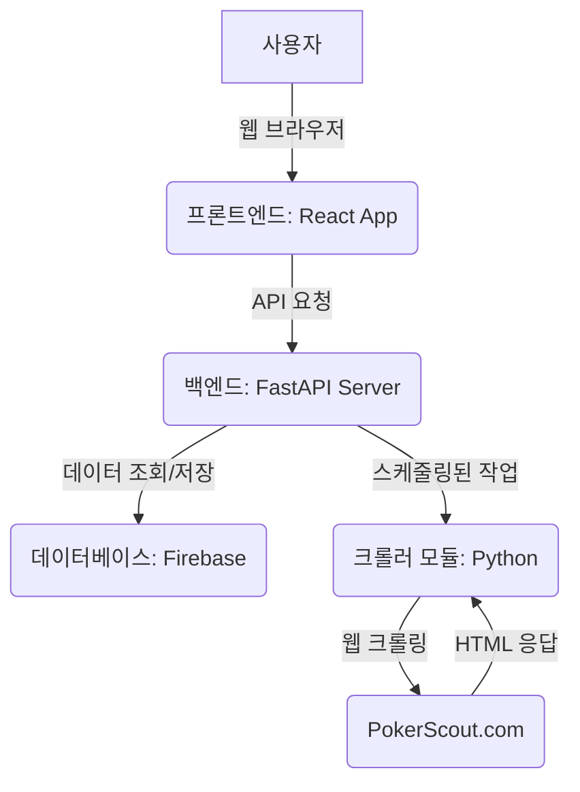

# 온라인 포커 데이터 분석 플랫폼: 통합 기술 기획서

**문서 버전: 2.0 (2025-07-29)**

---

## 1. 프로젝트 개요

### 1.1. 목표

온라인 포커 시장의 트렌드를 파악하고자 하는 분석가 및 플레이어를 위해, [PokerScout.com](https://www.pokerscout.com)과 같은 공개된 데이터 소스로부터 트래픽 데이터를 매일 자동으로 수집, 분석 및 시각화하여 제공하는 웹 애플리케이션을 개발한다. GitHub 기반의 CI/CD 워크플로우를 구축하여 효율적이고 안정적인 개발 및 배포 프로세스를 확립하는 것을 포함한다.

### 1.2. 주요 기능

- **데이터 자동 수집:** PokerScout의 온라인 플레이어 수, 캐시 플레이어 수, 24시간 피크 트래픽 등의 핵심 지표를 매일 자동 크롤링.
- **데이터 저장 및 관리:** 수집된 시계열 데이터를 구조화된 데이터베이스에 저장하여 이력을 관리.
- **데이터 시각화 대시보드:**
  - 사이트별 현재 통계 및 실시간 순위 제공.
  - 시간 경과에 따른 주요 지표(플레이어 수, 트래픽 등) 변화를 보여주는 트렌드 차트.
  - 특정 사이트 간의 핵심 지표를 비교 분석하는 차트.
- **분석 리포트:** GG 포커와 주요 경쟁사 간의 시장 점유율 및 트렌드 비교 분석 리포트.
- **사용자 인터페이스:** 직관적이고 반응형 디자인을 갖춘 웹 UI 제공.

### 1.3. 대상 사용자

- 온라인 포커 시장 트렌드에 관심 있는 데이터 분석가.
- 특정 포커 룸의 성장세를 추적하는 포커 플레이어.
- 데이터 기반 의사결정을 필요로 하는 포커 관련 비즈니스 종사자.

---

## 2. 시스템 아키텍처 및 기술 스택

### 2.1. 시스템 아키텍처

### 2.2. 기술 스택

| 구분 | 기술 | 목적 |
|---|---|---|
| **프론트엔드** | React (TypeScript), Chart.js/Recharts, Tailwind CSS | 확장 가능한 UI 개발, 데이터 시각화, 반응형 디자인 |
| **백엔드** | Python (FastAPI), APScheduler | 고성능 API 서버 구축, 비동기 처리, 백그라운드 작업 스케줄링 |
| **데이터베이스** | Firebase (Firestore/Realtime Database) | NoSQL 데이터 저장 및 실시간 동기화 |
| **데이터 수집** | Python (Cloudscraper, BeautifulSoup) | Cloudflare 우회 및 안정적인 HTML 파싱 |
| **배포/운영** | Docker, GitHub Actions, Render (백엔드), Vercel (프론트엔드) | 컨테이너화, CI/CD 자동화, 클라우드 배포 |
| **버전 관리** | Git / GitHub | 소스 코드 관리 및 협업 |

---

## 3. 핵심 기능 상세: 데이터 크롤러 (`poker_crawler.py`)

크롤러는 전체 시스템의 데이터 근간을 마련하는 가장 중요한 모듈이다.

### 3.1. 작동 원리

`LivePokerScoutCrawler` 클래스를 통해 체계적으로 실행되며, 주요 프로세스는 다음과 같다.

1.  **초기 설정**: `cloudscraper`를 사용하여 실제 브라우저(Chrome on Linux)처럼 위장하고, 'GGNetwork' 등 분류 기준이 될 사이트 리스트를 정의한다.
2.  **웹사이트 접속**: `https://www.pokerscout.com`에 GET 요청을 보내 HTML을 받아온다.
3.  **데이터 파싱**: `BeautifulSoup`으로 HTML을 파싱하여 핵심 데이터가 담긴 `rankTable`을 찾는다.
4.  **데이터 추출 및 가공**:
    -   테이블의 각 행(`<tr>`)을 순회하며 광고 행은 필터링한다.
    -   열의 순서가 아닌, `<td>` 태그의 고유 `id` (`online`, `cash` 등)를 기준으로 데이터를 정확하게 추출하여 웹사이트 구조 변경에 대한 안정성을 확보한다.
    -   추출된 숫자에서 쉼표(`,`)를 제거하고 정수로 변환한다.
    -   주요 트래픽 데이터가 모두 0인 무의미한 행은 건너뛴다.
    -   사이트 이름을 정규식으로 표준화하고, 미리 정의된 리스트를 기준으로 `GG_POKER` 또는 `COMPETITOR`로 분류한다.
5.  **결과 저장**: 추출된 모든 데이터를 리스트에 담아 반환한다. **현재 로직상으로는 이 데이터가 로컬 JSON 파일로만 저장되며, Firebase 연동 코드는 존재하지 않는다.**

### 3.2. 오류 처리

`try...except` 블록을 통해 네트워크 오류나 웹사이트 구조 변경 등 예외 발생 시에도 전체 프로세스가 중단되지 않고, 오류를 로깅한 후 안전하게 종료되도록 설계되었다.

---

## 4. 개발 및 운영 계획

### 4.1. 개발 워크플로우

- **저장소 구조:** 프론트엔드와 백엔드를 명확히 분리하고, 각 영역에 `Dockerfile` 및 테스트 코드를 배치하여 독립적인 개발 및 배포가 가능하도록 구성한다.
- **브랜칭 전략:** `main` (배포), `develop` (통합), `feature/*` (기능 개발) 브랜치를 사용하는 Git-flow를 따른다.
- **코드 리뷰:** 모든 코드 변경은 Pull Request (PR)를 통해 동료의 리뷰를 거친 후 `develop` 브랜치에 병합한다.
- **이슈 관리:** GitHub Issues를 사용하여 모든 작업(기능, 버그, 개선)을 추적하고 PR과 연동한다.

### 4.2. CI/CD (지속적 통합 및 배포)

GitHub Actions를 통해 아래 프로세스를 자동화한다.

- **CI (Continuous Integration):**
  - Pull Request 생성 시 자동으로 코드 린팅, 단위 테스트, 빌드를 수행한다.
  - 모든 검증을 통과해야만 브랜치 병합이 가능하다.
- **CD (Continuous Deployment):**
  - `main` 브랜치에 변경 사항이 병합되면 자동으로 트리거된다.
  - 백엔드는 Render, 프론트엔드는 Vercel에 최신 버전이 자동 배포된다.
  - 데이터 수집 크롤러는 매일 자정(UTC)에 스케줄링된 워크플로우를 통해 자동 실행된다.

### 4.3. 로컬 환경 설정

- **실행:** 각 서비스(백엔드, 프론트엔드)는 해당 디렉터리로 이동하여 `pip install -r requirements.txt` 및 `uvicorn main:app --reload`, `npm install` 및 `npm start` 명령을 통해 로컬에서 직접 실행한다.
- **Docker (선택 사항):** `docker-compose.yml`을 제공하지만, 현재 Windows 환경에서의 권한 문제로 로컬 직접 실행을 권장한다.

### 4.4. Secret 관리

배포 및 서비스 연동에 필요한 모든 키(`RENDER_BUILD_HOOK_URL`, `VERCEL_TOKEN`, `FIREBASE_SERVICE_ACCOUNT_KEY` 등)는 GitHub 저장소의 `Actions Secrets`에 안전하게 저장하여 관리한다.

---

## 5. 프로젝트 진행 로그 (요약)

- **(초기)** 프로젝트 목표, 기술 스택, 아키텍처 등 초기 기획 완료.
- **(2025-07-27)** FastAPI 백엔드, React 프론트엔드 초기 스캐폴딩 및 Docker 환경 설정. 크롤러 모듈을 백엔드 서비스로 통합. CORS 문제 등 초기 연동 이슈 해결.
- **(2025-07-28)** Docker 환경의 지속적인 포트 및 파일 시스템 오류로 인해, 로컬 환경 직접 실행 방식으로 개발 전략 전환. GitHub Actions의 CI/CD 워크플로우 경로 문제 디버깅 및 수정.
- **(현재)** 핵심 기능(크롤링, API, 기본 UI)의 기반을 다지고, 안정적인 개발 및 배포 자동화 파이프라인을 구축하는 데 집중.
