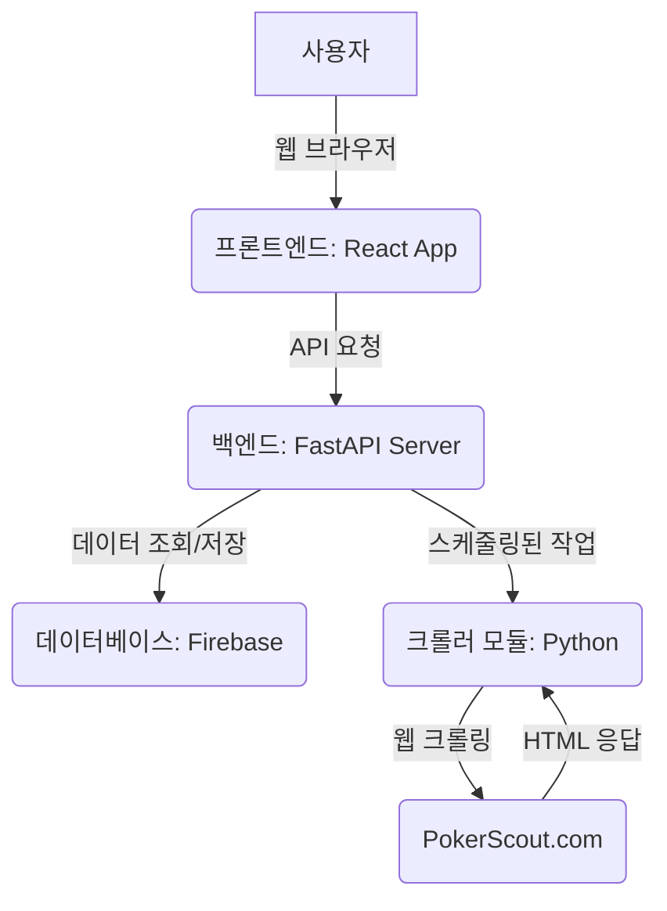

# 온라인 포커 데이터 분석 웹 애플리케이션 개발 기획서

## 버전 기록

### 1.0.12 (2025-07-28)
*   **개발 진행:**
    *   FastAPI 기본 서버 (`backend/main.py`) 구축 및 `requirements.txt`에 `fastapi`, `uvicorn` 추가.

### 1.0.11 (2025-07-27)
*   **개발 진행:**
    *   Docker 환경 문제(ports are not available 오류 지속)로 인해 Docker 환경 사용을 중단하고 로컬 환경에서 직접 실행하기로 결정.
*   **이슈:** 각 서비스(PostgreSQL, FastAPI 백엔드, React 프론트엔드)를 로컬에 직접 설치 및 설정해야 함.

### 1.0.10 (2025-07-27)
*   **개발 진행:**
    *   `ports are not available` 오류 지속으로 인해 Docker Desktop 초기화 결정.
*   **이슈:** Docker Desktop 초기화 필요. 이 작업은 모든 Docker 이미지와 컨테이너를 삭제하므로 신중하게 진행해야 함.

### 1.0.9 (2025-07-27)
*   **개발 진행:**
    *   `docker-compose.yml` 파일에서 프론트엔드 포트 매핑을 `3000:3000`에서 `3001:3000`으로 변경.
    *   Docker Desktop 재시작 및 관리자 권한으로 터미널 실행 후 `docker-compose up --build` 재시도.
*   **이슈:** `ports are not available` 오류 지속. 포트 3001이 사용 중이지 않음에도 불구하고 발생. Windows 방화벽 설정 확인 및 Docker Desktop 초기화 필요성 제기.

### 1.0.8 (2025-07-27)
*   **개발 진행:**
    *   `backend/app/schemas/schemas.py`에서 Python 3.9 호환성을 위해 `int | None` 타입을 `Union[int, None]`으로 수정.
    *   `frontend/Dockerfile`에서 `COPY package.json package-lock.json ./`를 `RUN npm install` 이전에 배치하여 `npm install` 캐시 무효화 및 `cross-env` 설치 보장.
    *   Docker 컨테이너 재빌드 및 재시작.
*   **이슈:** `read-only file system` 오류 발생. Docker 환경 설정 또는 권한 문제로 추정.

### 1.0.7 (2025-07-27)
*   **개발 진행:**
    *   프론트엔드에서 "Error: Failed to fetch" 오류 해결 시도.
    *   `frontend/package.json`의 `start` 스크립트에 `cross-env HOST=0.0.0.0` 환경 변수 추가.
    *   프론트엔드 Docker 컨테이너 재빌드 및 재시작.
*   **이슈:** 브라우저 캐시 문제 또는 추가적인 CORS 설정 확인 필요.

### 1.0.6 (2025-07-27)
*   **개발 진행:**
    *   프론트엔드에서 "Error: Failed to fetch" 오류 발생 확인.
    *   백엔드 로그에서 `/api/sites` 요청에 대한 200 OK 응답 확인.
    *   CORS (Cross-Origin Resource Sharing) 문제로 판단, `backend/main.py`에 `CORSMiddleware` 추가 및 백엔드 컨테이너 재시작.
*   **이슈:** CORS 미들웨어 추가 후에도 프론트엔드에서 "Error: Failed to fetch" 오류 지속. 브라우저 캐시 문제 또는 추가적인 CORS 설정 확인 필요.

### 1.0.5 (2025-07-27)
*   **개발 진행:**
    *   프론트엔드 (`frontend/src/App.tsx`)에서 백엔드 API (`/api/sites`)를 호출하여 사이트 목록을 테이블 형태로 표시하도록 UI 개선.
    *   `App.tsx` 파일 수정 및 프론트엔드 Docker 컨테이너 재빌드 및 재시작.
    *   백엔드 API (`http://localhost:8000/`) 및 프론트엔드 (`http://localhost:3000/`) 정상 작동 확인.

### 1.0.4 (2025-07-27)
*   **개발 진행:**
    *   프론트엔드 (`frontend/src/App.tsx`)에서 백엔드 API (`/api/sites`)를 호출하여 사이트 목록을 가져와 표시하도록 구현.
    *   `App.tsx` 파일 수정 및 프론트엔드 Docker 컨테이너 재빌드 및 재시작.
    *   백엔드 API (`http://localhost:8000/`) 및 프론트엔드 (`http://localhost:3000/`) 정상 작동 확인.

### 1.0.3 (2025-07-27)
*   **개발 진행:**
    *   Docker Compose를 이용한 컨테이너 빌드 및 실행 재시도.
*   **이슈:** Windows 환경에서 Docker Desktop 권한 문제로 `docker-compose up` 지속적인 실패. Docker Desktop 실행 및 관리자 권한으로 터미널 실행 필수.

### 1.0.2 (2025-07-27)
*   **개발 진행:**
    *   Docker Compose를 이용한 컨테이너 빌드 및 실행 재시도.
*   **이슈:** Windows 환경에서 Docker Desktop 권한 문제로 `docker-compose up` 지속적인 실패. Docker Desktop 실행 및 관리자 권한으로 터미널 실행 필수.

### 1.0.1 (2025-07-27)
*   **개발 진행:**
    *   FastAPI 백엔드 초기 설정 (main.py, database, schemas, crud, api/endpoints 구조).
    *   PostgreSQL 데이터베이스 모델 및 세션 설정.
    *   Pydantic 스키마 정의.
    *   기존 크롤링 스크립트 (`live_pokerscout_crawling.py`)를 백엔드 서비스 모듈로 통합 및 재구성 (`poker_crawler.py`).
    *   FastAPI 엔드포인트 (`/api/crawl_and_save_data`, `/api/sites`, `/api/sites/{site_id}/stats`) 구현.
    *   `requirements.txt` 파일 생성.
    *   `python-dotenv`를 사용하여 환경 변수 (`DATABASE_URL`) 로드 설정.
    *   `APScheduler`를 이용한 일별 크롤링 자동화 스케줄링 추가.
    *   React (TypeScript) 프론트엔드 프로젝트 초기 스캐폴딩 및 파일 이동.
    *   백엔드 및 프론트엔드용 `Dockerfile` 생성.
    *   `docker-compose.yml` 파일 생성 (PostgreSQL, Backend, Frontend 서비스 정의).
*   **이슈:** Windows 환경에서 Docker Desktop 권한 문제로 `docker-compose up` 실패. Docker Desktop 실행 및 관리자 권한으로 터미널 실행 필요.

### 1.0.0 (2025-07-27)
*   초기 기획서 작성.
*   프로젝트 목표, 주요 기능, 기술 스택, 시스템 아키텍처, 개발 계획, 데이터 모델, 배포 전략, 테스트 계획, 유지보수 및 확장성, GitHub 기반 개발 워크플로우 정의.
*   프로젝트 파일 구조 정리 및 관련 파일 (`live_pokerscout_crawling.py`, `live_crawling_result_20250727_195422.json`, `corrected_crawling_top10.py`, `simple_top10_crawl.py`)를 `poker-online-analyze` 서브 폴더 내의 적절한 위치로 이동 (`crawlers`, `data`, `docs`).

## 1. 프로젝트 개요

### 목표
PokerScout.com과 같은 온라인 포커 사이트의 데이터를 매일 자동으로 수집하고, 이를 시각화하여 사용자에게 트렌드 및 비교 분석 정보를 제공하는 웹 애플리케이션을 개발합니다. GitHub 기반의 협업 및 CI/CD 워크플로우를 구축하여 효율적인 개발을 지향합니다.

### 주요 기능
*   **일별 데이터 크롤링:** PokerScout.com에서 온라인 플레이어 수, 캐시 플레이어 수, 24시간 피크, 7일 평균 등의 핵심 지표를 매일 자동 수집.
*   **데이터 저장 및 관리:** 수집된 데이터를 시계열 데이터베이스에 저장하여 이력 관리.
*   **데이터 시각화:**
    *   사이트별 현재 통계 및 순위 표시.
    *   시간 경과에 따른 플레이어 수, 캐시 플레이어 수 등의 트렌드 차트 제공.
    *   특정 사이트 간의 지표 비교 차트.
*   **분석 리포트:** GG 포커 사이트와 경쟁사 사이트 간의 비교 분석 리포트 제공.
*   **사용자 인터페이스:** 직관적이고 반응형 웹 UI 제공.

### 대상 사용자
*   온라인 포커 시장의 트렌드를 파악하고자 하는 분석가
*   특정 포커룸의 성장세를 추적하고자 하는 플레이어
*   데이터 기반 의사결정을 선호하는 포커 관련 비즈니스 관계자

## 2. 기술 스택

*   **프론트엔드 (Frontend):**
    *   **React (TypeScript):** 현대적이고 확장 가능한 UI 개발을 위한 라이브러리.
    *   **Chart.js / Recharts:** 데이터 시각화를 위한 차트 라이브러리.
    *   **Tailwind CSS / Bootstrap:** 반응형 및 일관된 UI 디자인을 위한 CSS 프레임워크.
*   **백엔드 (Backend):**
    *   **Python (FastAPI):** 고성능 API 서버 구축 및 데이터 처리 로직 구현. 비동기 처리에 강점.
    *   **APScheduler:** 백그라운드에서 일별 크롤링 작업을 스케줄링.
*   **데이터베이스 (Database)::**
    *   **Firebase (Firestore/Realtime Database):** NoSQL 데이터 저장 및 실시간 동기화에 적합한 클라우드 기반 데이터베이스.
*   **크롤링 (Crawling):**
    *   **Python (Cloudscraper, BeautifulSoup):** 웹사이트 접속 및 HTML 파싱을 통한 데이터 추출 (기존 스크립트 활용 및 개선).
*   **배포 (Deployment):**
    *   **Docker:** 애플리케이션 컨테이너화 및 환경 일관성 유지.
    *   **GitHub Actions:** CI/CD (지속적 통합/지속적 배포) 파이프라인 구축.
    *   **클라우드 플랫폼 (예: AWS EC2/ECS, Google Cloud Run, Heroku):** 실제 서비스 배포 환경.
*   **버전 관리 (Version Control):**
    *   **Git / GitHub:** 소스 코드 관리 및 협업.

## 3. 시스템 아키텍처



### 데이터 흐름
1.  **크롤링:** 백엔드의 스케줄러가 매일 정해진 시간에 크롤러 모듈을 실행하여 PokerScout.com에서 데이터를 수집합니다.
2.  **데이터 저장:** 수집된 데이터는 백엔드를 통해 Firebase에 저장됩니다.
3.  **데이터 요청:** 사용자가 웹 프론트엔드를 통해 특정 데이터(현재 순위, 트렌드 차트 등)를 요청합니다.
4.  **API 응답:** 프론트엔드는 백엔드 API에 요청을 보내고, 백엔드는 데이터베이스에서 필요한 데이터를 조회하여 프론트엔드에 JSON 형태로 응답합니다.
5.  **데이터 시각화:** 프론트엔드는 받은 데이터를 바탕으로 차트와 테이블을 렌더링하여 사용자에게 보여줍니다.

## 4. 개발 계획 (단계별 접근)

### 페이즈 1: MVP (Minimum Viable Product)
*   **환경 설정:** GitHub 저장소 생성, 기본 프로젝트 구조 설정 (프론트엔드/백엔드 분리).
*   **백엔드:**
    *   FastAPI 기본 서버 구축.
    *   Firebase 연동 및 기본 데이터 구조 정의 (사이트 정보, 일별 통계).
    *   기존 `live_pokerscout_crawling.py` 스크립트를 백엔드 모듈로 통합.
    *   APScheduler를 사용하여 일별 크롤링 자동화.
    *   현재 시점의 데이터를 반환하는 간단한 API 엔드포인트 (`/api/current_stats`).
*   **프론트엔드:**
    *   React 프로젝트 초기 설정.
    *   백엔드 API를 호출하여 현재 데이터를 가져와 테이블 형태로 표시하는 기본 대시보드 페이지.
*   **로컬 환경 설정:**
    *   Firebase 프로젝트 설정 및 서비스 계정 키 다운로드.
    *   FastAPI 백엔드 및 React 프론트엔드를 로컬에서 직접 실행할 수 있도록 환경 설정.

### 페이즈 2: 기능 확장
*   **백엔드:**
    *   과거 데이터를 조회할 수 있는 API 엔드포인트 (`/api/historical_stats`, `/api/site_trend`).
    *   특정 기간 동안의 데이터 집계 및 분석 로직 추가.
*   **프론트엔드:**
    *   날짜 범위 선택 기능을 포함한 트렌드 차트 페이지 구현 (Chart.js/Recharts 활용).
    *   두 개 이상의 사이트를 선택하여 지표를 비교하는 기능.
    *   UI/UX 개선 (필터링, 정렬 기능 등).
*   **CI/CD:** GitHub Actions를 이용한 자동화된 테스트 및 배포 파이프라인 구축.

### 페이즈 3: 고도화
*   **백엔드:**
    *   더 복잡한 분석 기능 (예: 성장률 계산, 예측 모델).
    *   알림 기능 (예: 특정 사이트의 플레이어 수가 급증/급감 시 알림).
*   **프론트엔드:**
    *   사용자 인증 및 개인별 대시보드 기능 (선택 사항).
    *   더욱 풍부한 시각화 옵션 및 커스터마이징 기능.
    *   모바일 반응형 디자인 강화.
*   **성능 최적화:** 데이터베이스 쿼리 최적화, 캐싱 전략 도입.

## 5. 데이터 모델

### `sites` 테이블
*   `id` (Primary Key, Integer)
*   `name` (String, Unique): 사이트 이름 (예: GGNetwork, PokerStars Ontario)
*   `category` (String): 사이트 분류 (예: GG_POKER, COMPETITOR)
*   `created_at` (Timestamp): 레코드 생성 시간
*   `updated_at` (Timestamp): 레코드 마지막 업데이트 시간

### `daily_stats` 테이블
*   `id` (Primary Key, Integer)
*   `site_id` (Foreign Key to `sites.id`, Integer)
*   `collected_at` (Timestamp, Index): 데이터 수집 시간 (날짜별 고유)
*   `players_online` (Integer): 현재 온라인 플레이어 수
*   `cash_players` (Integer): 캐시 게임 플레이어 수
*   `peak_24h` (Integer): 지난 24시간 피크 플레이어 수
*   `seven_day_avg` (Integer): 지난 7일 평균 플레이어 수

## 6. 배포 전략

1.  **로컬 환경 설정:**
    *   **PostgreSQL:** 로컬 시스템에 PostgreSQL을 설치하고 데이터베이스 및 사용자 계정을 설정합니다.
    *   **FastAPI 백엔드:** Python 및 `requirements.txt`에 명시된 라이브러리를 설치하고, 데이터베이스 연결 설정을 로컬 PostgreSQL에 맞게 조정한 후 직접 실행합니다.
    *   **React 프론트엔드:** Node.js 및 npm(또는 yarn)을 설치하고, 프론트엔드 종속성을 설치한 후 개발 서버를 실행합니다.

2.  **클라우드 배포 (향후 계획):**
    *   **MVP:** 단일 EC2 인스턴스에 프론트엔드, 백엔드, PostgreSQL을 직접 배포.
    *   **확장 시:** AWS ECS/EKS, Google Cloud Run, Kubernetes 등을 활용하여 서비스 확장성 및 안정성 확보.

## 7. 테스트 계획

*   **단위 테스트 (Unit Tests):**
    *   백엔드: API 엔드포인트 로직, 데이터 처리 함수, 데이터베이스 상호작용 로직.
    *   프론트엔드: React 컴포넌트의 렌더링 및 상태 관리.
*   **통합 테스트 (Integration Tests):**
    *   크롤러 모듈과 실제 웹사이트 간의 연동 테스트.
    *   백엔드 API와 데이터베이스 간의 연동 테스트.
*   **종단 간 테스트 (End-to-End Tests):**
    *   Cypress 또는 Playwright를 사용하여 사용자 시나리오 기반의 전체 웹 애플리케이션 흐름 테스트.
*   **성능 테스트:** 대량의 데이터 처리 및 동시 사용자 접속 시 시스템 성능 검증.

## 8. 유지보수 및 확장성

*   **로깅:** 백엔드 및 크롤러에 상세한 로깅 시스템을 구축하여 문제 발생 시 디버깅 용이성 확보.
*   **모니터링:** Prometheus, Grafana 등을 활용하여 시스템 리소스 및 애플리케이션 지표 모니터링.
*   **에러 핸들링:** 견고한 에러 처리 로직 구현 및 사용자에게 친화적인 에러 메시지 제공.
*   **데이터베이스 인덱싱:** 쿼리 성능 향상을 위해 필요한 컬럼에 인덱스 추가.
*   **코드 문서화:** 코드 내 주석 및 별도 문서 (README, API 문서)를 통해 코드 이해도 증진.
*   **모듈화:** 각 기능을 독립적인 모듈로 분리하여 유지보수 및 기능 추가 용이성 확보.

## 9. GitHub 기반 개발 워크플로우

### 저장소 구조
```
/poker-online-analyzer
├── backend/             # FastAPI 백엔드 코드
│   ├── app/
│   │   ├── api/         # API 엔드포인트 정의
│   │   ├── core/        # 설정, 로깅 등 핵심 유틸리티
│   │   ├── crud/        # 데이터베이스 CRUD 작업
│   │   ├── database/    # DB 모델 및 세션 관리
│   │   ├── schemas/     # Pydantic 모델 (데이터 유효성 검사)
│   │   └── services/    # 비즈니스 로직, 크롤링 로직
│   ├── tests/
│   ├── Dockerfile
│   ├── requirements.txt
│   └── main.py
├── frontend/            # React 프론트엔드 코드
│   ├── public/
│   ├── src/
│   │   ├── components/
│   │   ├── pages/
│   │   ├── services/    # API 호출 로직
│   │   └── App.tsx
│   ├── tests/
│   ├── Dockerfile
│   ├── package.json
│   └── tsconfig.json
├── .github/
│   └── workflows/       # GitHub Actions 워크플로우 정의
├── docker-compose.yml   # 로컬 개발 환경 설정
├── README.md
└── .gitignore
```

### 브랜칭 전략
*   **`main`:** 프로덕션 배포 가능한 안정적인 코드.
*   **`develop`:** 다음 릴리즈를 위한 통합 브랜치. 모든 기능 브랜치는 `develop`에서 시작하여 `develop`으로 머지됩니다.
*   **`feature/<feature-name>`:** 특정 기능 개발을 위한 브랜치.
*   **`bugfix/<bug-name>`:** 버그 수정을 위한 브랜치.
*   **`hotfix/<hotfix-name>`:** `main` 브랜치에서 발생한 긴급 버그 수정을 위한 브랜치.

### 이슈 관리
*   GitHub Issues를 사용하여 기능 요청, 버그, 개선 사항 등을 추적합니다.
*   각 이슈는 명확한 제목, 설명, 담당자, 라벨 (bug, feature, enhancement 등)을 가집니다.
*   이슈 번호는 커밋 메시지 및 Pull Request에 참조됩니다.

### 코드 리뷰
*   모든 코드 변경은 Pull Request (PR)를 통해 이루어지며, 최소 한 명 이상의 동료 개발자의 리뷰를 거쳐야 `develop` 또는 `main` 브랜치로 머지될 수 있습니다.
*   PR은 관련 이슈를 참조하고, 변경 사항에 대한 명확한 설명을 포함합니다.

### CI/CD (Continuous Integration/Continuous Deployment)
*   **GitHub Actions:**
    *   **CI (지속적 통합):**
        *   `push` 또는 `pull_request` 이벤트 발생 시 자동 트리거.
        *   코드 린팅 (ESLint, Black, Flake8 등).
        *   단위 테스트 및 통합 테스트 실행.
        *   빌드 (프론트엔드: `npm run build`, 백엔드: Docker 이미지 빌드).
        *   모든 단계 통과 시에만 머지 허용.
    *   **CD (지속적 배포):**
        *   `main` 브랜치에 머지될 때 자동 트리거.
        *   최신 Docker 이미지 빌드 및 컨테이너 레지스트리에 푸시.
        *   배포 서버에 SSH 접속하여 최신 이미지로 서비스 업데이트 명령 실행.

## 10. 향후 계획

*   **다양한 데이터 소스 통합:** PokerScout 외 다른 포커 통계 사이트의 데이터도 수집하여 통합 분석.
*   **사용자 맞춤형 대시보드:** 로그인 기능을 추가하여 사용자가 관심 있는 사이트나 지표를 선택하여 자신만의 대시보드를 구성.
*   **알림 시스템:** 특정 조건 (예: 플레이어 수 급변) 발생 시 이메일 또는 모바일 알림.
*   **모바일 애플리케이션:** React Native 또는 Flutter를 사용하여 모바일 앱 개발.
*   **고급 분석:** 머신러닝을 활용한 트렌드 예측 또는 이상 감지.

## 11. 프로세스 진행 및 버전 관리

*   **진행 상황 기록:** 모든 개발 프로세스 진행 시 `poker_analysis_project_plan.md` 파일에 버전 및 패치 노트를 작성하여 현재 진행 상황과 변경 사항을 명확히 기록합니다.
*   **재시작 가능성:** 이 문서는 언제든지 개발이 중단되거나 재시작될 경우, 현재까지의 진행 상황을 파악하고 다음 단계를 명확히 알 수 있도록 하는 핵심 문서로 활용됩니다.